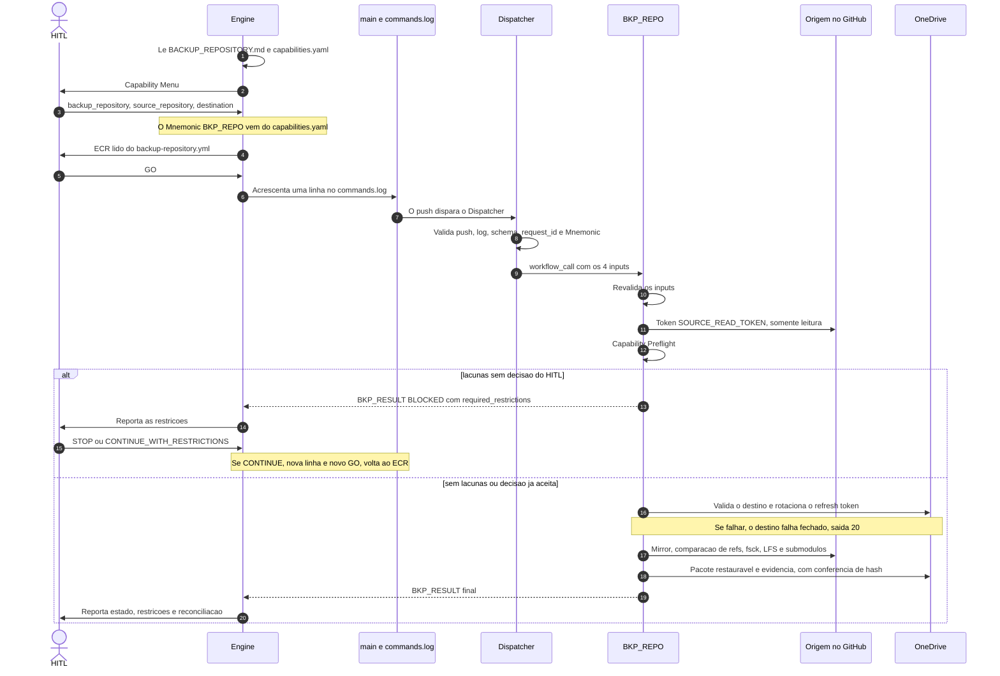

# Backup Repository — Protocolo de Execução Portável

> Ponto de entrada oficial do processo de preservação completa de repositórios. Um engine de IA **deve** conseguir começar por aqui, sem nenhuma memória de conversas anteriores.

## 1. Resumo

**O que é.** Um sistema que copia um repositório do GitHub (a **origem**, sempre somente leitura) para o OneDrive pessoal (o **destino**). Cada execução exige autorização humana (o **HITL**) e gera evidência verificável. A origem nunca é alterada.

**Objetivo final: restaurar.** O backup existe para que, depois de salvo no OneDrive, ele possa ser acessado direto de lá e, se necessário, **restituído ao GitHub**. Um backup só está provado quando uma restauração funciona. A restauração é **PLANEJADA** (seção I.14).

**Como funciona, em seis linhas**
1. O **engine** (o assistente de IA) apresenta o menu de capabilities. O HITL escolhe `backup_repository` e informa origem e destino.
2. O engine apresenta o pedido exato (o **ECR**), lido do workflow. O HITL dá **GO**.
3. O engine grava **uma linha** no `commands.log`, no `main`.
4. O **Dispatcher** valida a linha e chama o workflow `BKP_REPO`.
5. O `BKP_REPO` faz a verificação prévia (preflight), valida o destino, lê a origem, envia o **pacote restaurável** e a evidência ao OneDrive.
6. O engine lê o resultado e o reporta ao HITL.

**Regras que nunca se quebram**
- Nada é inferido. Sem GO explícito para o pedido exato, nada executa, e o GO não é reutilizável.
- A origem é sempre somente leitura.
- Falta de evidência nunca é sucesso. O que não pôde ser lido fica `NOT-VERIFIED`, nunca "ausente".
- Segredo em texto puro nunca aparece em chat, log ou evidência.
- Código só entra por pull request. A única escrita direta no `main` é o `commands.log`, e só depois do GO.

**Estado atual (02/10/2026).** O fluxo foi **provado de ponta a ponta em execução real** para um repositório pequeno (1 ref, sem LFS, sem submódulos): a escolha da capability, o GO, o `commands.log`, o Dispatcher, o preflight, o gate do destino no OneDrive real (com rotação do refresh token pelo App Writer), o mirror, o pacote e a evidência no OneDrive terminaram `COMPLETE_WITH_EXCEPTIONS`, e o **pacote restaurou para um repositório novo no GitHub** (bundle verificado, refs iguais ao `refs.tsv`, arquivos iguais ao zip, exceto o fim de linha do Windows). Hoje o backup prova o **código Git** em run real. As classes `labels`, `milestones` e `issues` são lidas pela API e foram **provadas em run real** (02/10/2026, repositório de teste de issues: 4 etiquetas, 1 marco, 6 issues e 5 comentários, `api-issues.json` conferido pelo HITL contra o repositório; seção I.14); a classe `projects` (GitHub Projects v2) também foi **provada em run real**, de forma **parcial** (`PARTIALLY-PRESERVED`: o estado do quadro é preservado, e a referência das issues de repositório privado fica oculta; seção I.14); as demais 13 classes são restrições aceitas. O backup só de Projects (`backup_projects`, Mnemonic `BKP_PROJ`) foi **provado em run real** nos três escopos (`PROJECT`, `OWNER_PROJECT_SET` e `SOURCE_REPOSITORY`), e a regressão do `BKP_REPO` depois da generalização também passou em run real (seção I.14). **Provado também:** repositório com arquivo de ~25 MiB (envio em blocos), Git LFS, submódulo, 2 branches e 2 tags (a classe `git` fica `PARTIALLY-PRESERVED`: do submódulo só o gitlink), hash conferido no destino por `quickXorHash`, e restauração com LFS (4 refs iguais, arquivo LFS com o tamanho real). **Não provado:** repositórios muito grandes, conteúdo de submódulos, nomes com acento no OneDrive, reações e relações entre issues (o repositório de teste não tem), pull requests e restauração pela API.

**Onde encontrar cada coisa**

| Preciso de… | Vá para |
|---|---|
| Abrir um chat novo (o primeiro prompt e os arquivos a ler) | **I.0** |
| Operar um backup, passo a passo | Parte I, seções I.3 e I.4 |
| Saber quem faz o quê | I.1 |
| Entender uma linha do `commands.log` | I.6 |
| Saber de onde vem o Mnemonic | I.7 |
| Interpretar um resultado ou um código de saída | I.8 e I.12 |
| Saber onde ficam segredos e variáveis | I.10 |
| Saber o que dá para restaurar e o que não dá | **I.14** |
| Fazer o check de rastreabilidade bloquear merges (opcional) | **I.15** |
| Ver as regras obrigatórias | Parte II |
| Saber o significado de um termo | Parte III |

## 2. Como ler este documento

| Parte | Conteúdo | Natureza |
|---|---|---|
| **Parte I: Operação** | Players, fluxo passo a passo, arquivos, segredos, códigos de saída | Guia prático |
| **Parte II: Protocolo normativo** | Regras obrigatórias do processo | **Normativa**: em caso de conflito, vale esta parte |
| **Parte III: Glossário** | Termos usados e seus significados | Referência |

**Convenções**
- **DEVE**, **NÃO DEVE**, **PODE**: obrigação, proibição e permissão, nesse sentido estrito.
- Nomes de campos, códigos e estados ficam no original, em `MAIÚSCULAS` ou em código (`PRESERVED`, `BLOCKED`, `request_id`), porque os scripts e os schemas os usam.
- Termos técnicos consagrados (Capability Preflight, Source Inventory, HITL, ECR) são mantidos e explicados na Parte III.
- Itens marcados **PLANEJADO** ainda não existem. Serão atualizados quando forem implementados.

---

# Parte I: Operação

## I.0 Como iniciar: o primeiro prompt de um chat novo

**Princípio.** O engine não tem memória. Tudo o que ele precisa está no repositório **`Moriblo/repo_backup`**, branch **`main`**. Ele **deve** ler a versão **atual** de lá, e nunca confiar em conversas anteriores. Por isso o primeiro prompt só precisa dizer **onde ler**.

**1. Arquivos que o engine lê no início (sempre os dois, nesta ordem)**

| Ordem | Arquivo (no `main`) | Para quê |
|---|---|---|
| 1 | `BACKUP_REPOSITORY.md` | O protocolo: regras, fluxo e guia operacional. |
| 2 | `backup/capabilities.yaml` | O registro: a lista de capabilities do **menu**, o Mnemonic e os parâmetros de cada uma. |

Endereço: `https://github.com/Moriblo/repo_backup/blob/main/<caminho>`. O engine precisa de acesso de leitura ao repositório (conector do GitHub ou clone).

**2. Arquivos que o engine lê depois que você escolhe uma capability**

| Capability | Lê também | Observação |
|---|---|---|
| `backup_repository` | `.github/workflows/backup-repository.yml` (o ECR, nos `inputs`); `backup/schemas/commands-log-line.schema.yaml` (formato da linha); `commands.log` (ids já usados) | O caminho do workflow vem do registro: `command_workflow.artifact_id` da capability, resolvido em `implementation_artifacts[].location.path`. |
| `backup_projects` | `.github/workflows/backup-projects.yml` (o ECR, nos `inputs`); `backup/schemas/commands-log-line.schema.yaml` (formato da linha, ramo `BKP_PROJ`); `commands.log` (ids já usados) | Mnemonic `BKP_PROJ`. O caminho do workflow vem do registro, como no `backup_repository`. Parâmetros: `scope`, `scope_identifiers` e `destination` (seção II.15). |
| `list_capabilities`, `show_status`, `validate_evidence`, `help` | Só os dois iniciais | O engine responde na conversa. Não geram linha de comando. |
| `backup_issues` | `.github/workflows/backup-issues.yml` (o ECR, nos `inputs`); `backup/schemas/commands-log-line.schema.yaml` (ramo `BKP_ISSUES`); `commands.log` (ids já usados) | Mnemonic `BKP_ISSUES`. Backup só de **labels, milestones e issues** de **um** repositório (seção I.14). Parâmetros: `source_repository` e `destination`, como no `backup_repository`. Não copia o código nem os Projects. |
| `restore_repository` | `.github/workflows/restore-repository.yml` (o ECR, nos `inputs`); `backup/schemas/commands-log-line.schema.yaml` (ramo `RST_REPO`); `commands.log` (ids já usados) | Mnemonic `RST_REPO`. Restaura um backup do `BKP_REPO` para um repositório **novo e privado** (seção I.14). Parâmetro obrigatório: `backup_path` (pasta do backup no OneDrive); opcional: `target_name`. **Escreve no GitHub**: o engine **deve** mostrar no ECR o nome do alvo que será criado antes do GO. |
| Capability nova no futuro | O que o registro indicar para ela | O menu vem do registro: **o prompt inicial não muda** quando uma capability é acrescentada. |

**Regra geral.** Se a capability escolhida tem `mnemonic` no registro, o engine lê o workflow apontado em `command_workflow` e apresenta o ECR a partir dele. Se não tem, responde na conversa e não grava nada.

**3. Prompt inicial (copie e cole)**

```text
Você é o engine do processo de backup de repositórios.
Repositório: Moriblo/repo_backup, branch main.

Leia, nesta ordem, a versão ATUAL do main:
1) BACKUP_REPOSITORY.md   (protocolo e guia operacional)
2) backup/capabilities.yaml   (registro; lista as capabilities do menu)

Depois apresente o Capability Menu e aguarde a minha escolha.
Não escolha por mim, não infira parâmetros e não grave nada até eu dar GO
para o pedido exato (ECR). Quando eu escolher uma capability, leia também os
arquivos que o registro indicar para ela.
Se não conseguir ler o repositório, pare e me avise. Não siga de memória.
```

**4. Pré-requisitos do chat**
- Acesso de **leitura** ao repositório, para todas as capabilities.
- Para gravar o `commands.log` (passo 5): acesso de escrita ao `main` e **autorização explícita do HITL**. O engine não grava sem ela.
- Nenhum token, chave ou segredo é colado no chat.

## I.1 Players

| Player | Papel |
|---|---|
| **HITL** (humano) | Escolhe a capability, informa os parâmetros, dá GO ou NO-GO, decide `STOP` ou `CONTINUE_WITH_RESTRICTIONS` no preflight e faz o merge dos PRs. |
| **Engine** (hoje, a sessão do Claude Code; outros no futuro, ver a issue #5) | Lê este protocolo, apresenta o menu e o ECR, grava a linha no `commands.log` depois do GO e reporta o resultado. Nunca infere autorização. |
| **Repositório `repo_backup`** (`main`) | Guarda o código, o `commands.log`, os segredos e as variáveis. Código só entra por pull request. |
| **GitHub Actions** | Executa o Dispatcher e o workflow do `BKP_REPO` (e, temporariamente, o diagnóstico). |
| **Token `SOURCE_READ_TOKEN`** | Token fine-grained (Contents, Metadata e **Issues** **somente leitura**, todos os repositórios; o *Issues: Read* é o que libera labels, milestones e issues), guardado como secret do environment `onedrive-backup`. É a credencial de leitura da origem. (O GitHub App "Repository Preservation Reader" continua só no workflow de diagnóstico temporário.) |
| **Token `PROJECTS_READ_TOKEN`** (**a criar**) | Token **clássico** com o escopo `read:project` (somente leitura), guardado como secret do environment `onedrive-backup`. É a credencial da classe `projects`: token fine-grained não alcança Projects v2 de conta pessoal (a confirmar no primeiro run real). Esse token não enxerga repositórios privados. Sem ele, `projects` fica como restrição (`ACCESS_PERMISSION_GAP`). |
| **GitHub App Writer** (**OPCIONAL**, criado) | Regrava o novo refresh token do OneDrive no secret do environment. Só *Secrets: Read and write* e *Environments: Read and write*. Sem ele, a rotação fica desligada (seção I.11). |
| **Repositório de origem** | É lido e **nunca alterado**. |
| **Microsoft Entra, app público** (configuração pelo HITL pendente) | Emite os tokens do OneDrive pela autoridade `consumers` (conta pessoal). |
| **Microsoft Graph e OneDrive** | Recebem o pacote e a evidência em `Apps/<nome do registro>/<destination>/<request_id>/{package,evidence}/`. |

## I.2 Preparação, uma única vez (feita pelo HITL)

O código já está no repositório (SA-08). O HITL já fez (environment `onedrive-backup`): registro no Entra ("GitHub repo_backup", só contas pessoais, permissões delegadas `Files.ReadWrite.AppFolder` e `offline_access`), variável `ONEDRIVE_CLIENT_ID` e secrets `ONEDRIVE_REFRESH_TOKEN` e `SOURCE_READ_TOKEN`. O workflow declara `environment: onedrive-backup` para enxergá-los. **Falta criar** o secret `PROJECTS_READ_TOKEN` (token clássico com `read:project`, seção I.10) para a classe `projects`; sem ele, `projects` continua como restrição.
- **Opcional (rotação):** criar o GitHub App **Writer** (*Secrets: Read and write* e *Environments: Read and write*, instalado só em `Moriblo/repo_backup`; o *Environments* é necessário porque o secret fica em um environment) e gravar a variável `REPOSITORY_PRESERVATION_SECRETS_APP_ID` e o secret `REPOSITORY_PRESERVATION_SECRETS_APP_PRIVATE_KEY`. Sem isso o backup funciona, mas o refresh token **não** é renovado (seção I.11).
- **Atenção:** não rode dois backups ao mesmo tempo. Com rotação ligada, cada execução gira o refresh token; duas em paralelo podem invalidar uma à outra.
- **Atenção:** se o environment tiver "Required reviewers", cada execução espera aprovação no GitHub.
- **Antes da restauração (`RST_REPO`):** criar o secret `RESTORE_WRITE_TOKEN` (ver I.10) no environment `onedrive-backup` e **restringir o environment à branch `main`** (Settings → Environments → Deployment branches). Esse token é o primeiro com poder de escrita no GitHub: só o workflow do `RST_REPO` o usa, e só no repositório que ele cria.

## I.3 Os 15 passos de cada execução (índice)

O texto de cada passo, com o que entra, o que acontece, o que pode falhar e o que sai, está na seção I.4, nos títulos "Passo N". Os títulos não são links de propósito: links internos não funcionam em todas as telas do GitHub.

| # | Passo | Quem | Hoje |
|---|---|---|---|
| 1 | O engine apresenta o Capability Menu | Engine | Existe |
| 2 | O HITL escolhe a capability e informa os parâmetros | HITL | Existe |
| 3 | O engine apresenta o ECR (Exact Command Request) | Engine | Existe |
| 4 | O HITL dá GO ou NO-GO | HITL | Existe |
| 5 | O engine grava a linha no `commands.log` | Engine | Existe |
| 6 | O Dispatcher valida o push e as linhas novas | Actions | Existe |
| 7 | O Dispatcher chama o workflow do Mnemonic | Actions | Existe |
| 8 | O `BKP_REPO` começa | Actions | Existe |
| 9 | Capability Preflight | Actions | Existe |
| 10 | O engine reporta e o HITL decide | Engine e HITL | Existe |
| 11 | Validação do destino | Actions | Existe; provado em run real |
| 12 | Leitura da origem | Actions | Existe (com conferência de refs origem × mirror) |
| 13 | Pacote e envio ao OneDrive | Actions | Existe; provado em run real (hash por `quickXorHash`) |
| 14 | Evidência e manifest | Actions | Existe (evidência também enviada ao OneDrive) |
| 15 | O engine reporta o resultado | Engine e HITL | Existe |

**Observações**
- Com as 13 restrições atuais (todas as classes, menos `git`, `labels`, `milestones`, `issues` e `projects`; são 14 se o `PROJECTS_READ_TOKEN` não existir), toda execução exige **duas linhas** no `commands.log`: a primeira termina `BLOCKED`, e a segunda carrega a decisão do HITL.
- O `request_id` de uma linha rejeitada ou bloqueada fica **queimado**: o log só recebe acréscimos, e a autorização não é reutilizável.
- Enquanto o passo 11 falhar fechado, nada é copiado e nenhuma evidência é gerada.

## I.4 Fluxo detalhado, passo a passo

Cada passo diz **quem** age, o que **entra**, o que **acontece** (com os arquivos), o que pode **falhar** e o que **sai**.

#### Passo 1: o engine apresenta o Capability Menu
- **Quem:** engine.
- **Entra:** o pedido do HITL para iniciar um backup.
- **Acontece:** o engine lê, na versão atual do `main` de `Moriblo/repo_backup`, este documento e o `backup/capabilities.yaml` (seção I.0) e apresenta as capabilities que o registro lista (hoje, seis). Ele **não escolhe** por conta própria.
- **Falha:** se não conseguir ler o registro, o engine para e avisa. Nada é inferido de conversas anteriores.
- **Sai:** o menu.

#### Passo 2: o HITL escolhe a capability e informa os parâmetros
- **Quem:** HITL (o engine consulta o registro).
- **Acontece:**
  1. O HITL escolhe `backup_repository`.
  2. O engine consulta o registro e descobre o **Mnemonic** (`mnemonic: BKP_REPO`) e os **parâmetros requeridos** (`source_repository` e `destination`).
  3. Se a capability não tem Mnemonic no registro (ex.: `list_capabilities`), o engine responde na conversa e não grava nada.
  4. O HITL informa ou confirma cada valor. O engine pode **propor**, nunca substituir a confirmação, e nada é herdado de execuções anteriores.
- **Falha:** valor fora do formato é recusado. Exemplo real: o `destination` dado como URL do OneDrive foi recusado, porque o destino é um caminho **relativo ao AppFolder** (sem `/` inicial e sem `..`).
- **Sai:** capability, Mnemonic e valores.

#### Passo 3: o engine apresenta o ECR (Exact Command Request)
- **Quem:** engine.
- **Acontece:** lê os `inputs` do `on: workflow_call` de `.github/workflows/backup-repository.yml` e apresenta cada campo **exatamente como o workflow o define**, com a restrição e o valor proposto. Antes disso, confere os valores contra `commands-log-line.schema.yaml`.
- **Sai:** o ECR completo, para o GO.

#### Passo 4: o HITL dá GO ou NO-GO
- **Quem:** HITL.
- **Acontece:** o GO vale **somente para este ECR exato**. Mudou qualquer valor, é um novo ECR e um novo GO.
- **Falha:** NO-GO, resposta ambígua ou ausente: nada é gravado. Nenhuma autorização é presumida.

#### Passo 5: o engine grava a linha no `commands.log`
- **Quem:** engine, com uma identidade autorizada a gravar no `main` (hoje, o actor `Moriblo`; ver a issue #5).
- **Acontece:**
  1. Monta **uma linha JSON** (seção I.6), com o Mnemonic copiado do registro e a hora atual em `ts`.
  2. Roda localmente o mesmo verificador do dispatcher, como boa prática adotada nas execuções reais.
  3. Faz um commit **só com o `commands.log`** e o envia direto ao `main`. É a **única escrita direta** permitida no `main`.
- **Falha:** push recusado: nada dispara.
- **Sai:** um push no `main`, que dispara o Dispatcher.

#### Passo 6: o Dispatcher valida o push e as linhas novas
- **Quem:** GitHub Actions, `dispatcher.yml`, job **"Validate push and new command lines"**, com `backup/scripts/dispatch_check.py`.
- **Acontece:** sete verificações, nesta ordem. **A primeira que falhar recusa o push inteiro.**
  1. **Intervalo:** há commit anterior e ele é ancestral do novo (recusa criação de branch e reescrita de histórico).
  2. **Escrita direta:** todo commit da linha principal que altera arquivos além do `commands.log` precisa vir de um pull request mergeado (consulta à API). Commit que mistura `commands.log` com outros arquivos é recusado.
  3. **O log mudou?** Se não mudou (ex.: merge de PR), o push é aceito e não há nada a despachar. É o run verde e curto a cada merge.
  4. **Só acréscimo:** o conteúdo antigo é prefixo exato do novo, a última linha termina em quebra de linha e não há linha em branco.
  5. **Cada linha nova:** é JSON válido e cumpre `commands-log-line.schema.yaml`.
  6. **`request_id` único:** não repete nenhum id já presente no log nem outro do mesmo push.
  7. **Mnemonic:** consta no mapeamento fixo do dispatcher **e** o registro concorda com o workflow mapeado.
- **Falha:** saída **30**, job vermelho, **nada é despachado**. A mensagem diz qual regra falhou, sem repetir o conteúdo da linha.
- **Sai:** a linha `DISPATCH_ACCEPTED {json}` com os `request_id` aceitos.

#### Passo 7: o Dispatcher chama o workflow do Mnemonic
- **Quem:** GitHub Actions, job **`run-bkp-repo`**.
- **Acontece:** **traduz o Mnemonic em workflow** pelo mapeamento fixo (`BKP_REPO` → `.github/workflows/backup-repository.yml`) e o chama por `workflow_call`, com `secrets: inherit`, passando `request_id`, `source_repository`, `destination` e `preflight_decision`. Há um grupo de concorrência por `request_id`.
- **Falha:** sem linhas novas, o job é **pulado** (aparece cinza). Não é erro.

#### Passo 8: o `BKP_REPO` começa
- **Quem:** GitHub Actions, `backup-repository.yml`.
- **Acontece:**
  1. Baixa este repositório (scripts e schemas) e instala as bibliotecas do validador.
  2. **`validate-inputs`:** revalida os inputs contra o mesmo schema (segunda barreira). Recusa também `preflight_decision` ilegível e a reutilização de autorização (`previous_request_id` igual ao `request_id`).
  3. **Token de leitura:** o workflow usa o secret `SOURCE_READ_TOKEN` (somente leitura). Se faltar, o preflight registra a lacuna de acesso.
  4. **Token de Projects:** o workflow usa o secret `PROJECTS_READ_TOKEN` (token clássico, `read:project`) só para a classe `projects`. Se faltar, essa classe vira lacuna `ACCESS_PERMISSION_GAP` (restrição `RST-projects-ACCESS_PERMISSION_GAP`, que o HITL precisa aceitar) e o backup do código segue.
- **Falha:** entrada inválida termina com saída **2** e `BKP_RESULT` **`REJECTED`**. A falha do **token não derruba** o workflow: vira uma lacuna no preflight.

#### Passo 9: Capability Preflight
- **Quem:** GitHub Actions, `bkp_repo.py preflight`.
- **Acontece:** avalia as **18 classes** de objeto do `backup_repository`, cada rota separadamente. Hoje têm rota implementada `git`, `labels`, `milestones`, `issues` e `projects`. As outras **13** viram lacuna `EXECUTION_CAPABILITY_GAP`. Se o token de leitura não foi emitido, as implementadas também viram lacuna (`ACCESS_PERMISSION_GAP`), e são **18**. Se só o token de Projects faltar, só `projects` vira `ACCESS_PERMISSION_GAP` (**14** restrições). O resultado é validado contra o schema do command-request e gravado em `evidence/preflight.json`.
- **De onde vêm as restrições:** não são uma lista fixa. São **calculadas** a cada execução: as classes de `includes` (em `backup/capabilities.yaml`) menos as de `implemented_classes` (também em `backup/capabilities.yaml`, na capability). Hoje, 18 menos 5 (`git`, `labels`, `milestones`, `issues` e `projects`) dá **13**. Se o `PROJECTS_READ_TOKEN` faltar, `projects` volta como `RST-projects-ACCESS_PERMISSION_GAP` (ID **novo**, diferente do `RST-projects-EXECUTION_CAPABILITY_GAP` antigo) e são 14: o HITL precisa aceitá-lo. Cada uma tem o nome `RST-<classe>-<tipo da lacuna>`. A lista completa aparece no `BKP_RESULT`, no `preflight.json` e, depois de aceita, no `commands.log`. Implementar uma classe a retira das restrições (seção I.14).
- **Decisão:** a execução só segue se **todas** as restrições exigidas estiverem em `preflight_decision.accepted_restrictions`. Aceitar menos mantém o bloqueio.
- **Sai:** saída **10**, `BKP_RESULT` **`BLOCKED`** (`CAPABILITY_PREFLIGHT_GAPS`) com a lista `required_restrictions`, e os passos seguintes são pulados. Ou saída **0**, `BKP_RESULT` **`PREFLIGHT_OK`**. O artefato `bkp-repo-<request_id>` é publicado sempre.

#### Passo 10: o engine reporta e o HITL decide
- **Quem:** engine e HITL.
- **Acontece:** o engine lê a linha `BKP_RESULT` no log do passo "Capability Preflight" (Actions, run do Dispatcher, job "BKP_REPO `<request_id>`") e apresenta as restrições exigidas. O HITL escolhe:
  - **`STOP`:** encerra. Nenhuma linha é gravada, e o `request_id` usado continua queimado.
  - **`CONTINUE_WITH_RESTRICTIONS`:** o engine monta uma **nova linha**: **novo `request_id`**, os **mesmos** `source_repository` e `destination`, e o bloco `preflight_decision` (`previous_request_id` = a requisição bloqueada; `hitl_decision`; `accepted_restrictions` = os itens de `required_restrictions`). O fluxo **volta ao passo 3**, com novo ECR e novo GO.

#### Passo 11: validação do destino
- **Quem:** GitHub Actions, `bkp_repo.py validate-destination`.
- **Antes:** se a variável `REPOSITORY_PRESERVATION_SECRETS_APP_ID` existir, o passo "Issue secrets-writer token" emite o token do App Writer (`secrets: write`). Sem ela, a rotação fica desligada.
- **Acontece:** `onedrive.py` renova o access token, **grava o novo refresh token no secret** `ONEDRIVE_REFRESH_TOKEN` e faz uma escrita, uma leitura e um apagamento de arquivo de prova em `<destination>/<request_id>` no AppFolder.
- **Falha fechado:** qualquer problema (configuração ausente, login recusado, rotação do secret falhou, escrita negada) gera saída **20**, `BKP_RESULT` **`BLOCKED`** (`DESTINATION_NOT_VALIDATED`, com o código interno no `detail`). Nada é copiado. Antes da preparação da seção I.2, é isso que acontece.

#### Passo 12: leitura da origem
- **Quem:** GitHub Actions, passos bash do `backup-repository.yml`. Só chegam aqui com o destino validado.
- **Acontece:**
  1. Confere `git` e `git-lfs` no runner.
  2. Clona a origem com `git clone --mirror`. O token vai por cabeçalho HTTP, só nesse processo: não aparece na URL, no log nem na configuração do mirror.
  3. Grava `refs.tsv`, `git-fsck.txt` (`fsck --full --strict`) e `git-count-objects.txt`.
  4. Enumera Git LFS em todas as refs. Havendo objetos, baixa todos e confere o SHA-256 de cada um. Falhas: saída **3** (não listou), **4** (OID inválido), **5** (objeto ausente), **6** (hash divergente).
  5. Varre o histórico inteiro atrás de submódulos (`gitmodules-history.tsv`, `gitlinks-history.tsv`).
  6. Logo após o clone, compara as refs da **origem** (`git ls-remote`) com as do mirror. Qualquer diferença: saída **7** (`refs-compare.txt` mostra a diferença). Se a origem recebeu um push entre o clone e a consulta, dispare o backup de novo.
- **Falha:** o job fica vermelho no passo que falhou.

#### Passo 12b: leitura das classes de API (`labels`, `milestones`, `issues`)
- **Quem:** GitHub Actions (passo "Read API object classes"), com `backup/scripts/github_api_read.py`. Roda antes do pacote.
- **Acontece:** só requisições GET à API do GitHub, com o `SOURCE_READ_TOKEN`. Grava em `package/` os arquivos `api-labels.json`, `api-milestones.json`, `api-issues.json`, `api-issue-comments.json`, `api-issue-events.json`, `api-issue-reactions.json`, `api-issue-sub-issues.json`, `api-issue-dependencies.json` e `api-inventory.json`, e em `evidence/` o `api-status.json`.
- **Conferências (qualquer divergência marca a classe `FAILED`):** abertos lidos (issues mais pull requests) contra o `open_issues_count` do repositório; comentários lidos contra o contador de cada issue; etiquetas e marcos citados pelas issues contra as listas lidas.
- **Pull requests:** vêm na API de issues e ficam de fora; só os números vão ao inventário. A classe `pull_requests` continua pendente.
- **Disposição:** `PRESERVED-AS-EQUIVALENT-REPRESENTATION` se passou; `PRESERVED` sem objetos se o recurso está desativado na origem (HTTP 410); `FAILED` se faltou permissão (o token precisa de *Issues: Read*), a rede falhou ou alguma conferência reprovou.
- **Falha:** este passo não derruba o job. O pacote Git é enviado normalmente e o `build-evidence` marca a classe `FAILED`, o que deixa o job vermelho no final.
- **Provado em run real (02/10/2026, `req-20261002-001`, `Moriblo/backup_teste_issues`):** `labels` 4, `milestones` 1, `issues` 6 (pull requests fora) e 5 comentários, com as conferências aprovadas; `api-*.json` enviados ao OneDrive com hash por `quickXorHash`; textos, acentos, etiquetas, marco, issue editada e issue fechada conferidos pelo HITL no `api-issues.json`.
- **Limites:** relações entre issues só nos campos do próprio JSON da issue (a linha do tempo completa e os endpoints de sub-issues e dependências não são lidos); número, autor e datas originais não voltam idênticos; **não existe restauração pela API ainda**, os arquivos são registro.

#### Passo 12c: leitura da classe `projects` (GitHub Projects v2)
- **Quem:** GitHub Actions (passos "Provide Projects read token" e "Read Projects linked to the source repository"), com `backup/scripts/github_projects_read.py`. Roda depois do passo 12b e antes do pacote.
- **Acontece:** só **consultas** GraphQL (uma `mutation` é recusada antes de enviar), com o `PROJECTS_READ_TOKEN`. Descobre os Projects **ligados ao repositório de origem** (escopo `SOURCE_REPOSITORY`) e, de cada um, lê metadados, campos e opções, views, workflows, status updates e os itens (valores de campo, arquivados, rascunhos e referências a issues e pull requests). Grava `package/api-projects.json`, `api-project-items.json` e `api-projects-inventory.json`, e `evidence/api-projects-status.json`.
- **Descoberta:** primeiro `repository(...).projectsV2`. Se o token não enxerga o repositório (privado, sem o escopo `repo`), lista os Projects do dono. O GraphQL devolve `null` no lugar de um repositório ligado que o token não vê (**confirmado nos runs reais**): o token sabe **quantos** repositórios estão ligados, mas não **quais**. Entram os Projects que ligam a origem de forma visível; os que têm algum vínculo oculto são só **candidatos**.
- **Confirmação dos candidatos pelos títulos (regra E):** o leitor lê os itens do candidato e compara os títulos dos itens de issue com as issues da origem, que o passo 12b já gravou em `package/api-issues.json` (a leitura REST enxerga o repositório privado). O candidato **fica** se pelo menos 1 título bate e se bate pelo menos metade dos itens de issue; senão é **excluído e não entra no pacote**: o inventário guarda só o número, o título do Project e as contagens (`extra.excluded_candidates`, com o motivo `TITLES_DO_NOT_MATCH`, `NO_ISSUE_ITEMS` ou `NO_SOURCE_TITLES`). Cada Project guardado traz `linkage` (`VISIBLE_LINK`, `TITLE_MATCH` com as contagens, ou `REQUESTED_SCOPE`). **É uma heurística, não uma prova:** título repetido entre repositórios pode dar falso positivo, e uma origem sem issues, ou um Project só com rascunhos, não confirma nada. Nesses casos use o escopo `PROJECT` (`BKP_PROJ`, PR B).
- **Conferências:** total de itens lido contra o `totalCount`; nenhuma conexão cortada (campos, views, workflows, status updates, repositórios, valores de campo); todo valor de seleção cita uma opção que existe. Divergência = `FAILED`. Itens cujo conteúdo o token não vê (`REDACTED`, ou `ISSUE` com `content: null`) são contados e tornam a classe `PARTIAL`. **O estado do quadro sobrevive à ocultação** (provado no run `req-20261003-002`): o título, o Status, a Prioridade e as etiquetas de cada item vêm nos valores de campo; só se perde a referência da issue (número, URL, repositório, estado), que se reconstrói pelo título com a classe `issues`.
- **Disposição:** `PRESERVED-AS-EQUIVALENT-REPRESENTATION` se passou; `PARTIALLY-PRESERVED` se há itens ocultos ou a descoberta foi pela alternativa; `FAILED` se faltou permissão ou escopo, a rede falhou ou alguma conferência reprovou. Sem o `PROJECTS_READ_TOKEN`, o passo nem roda e a classe fica `NOT-VERIFIED` (restrição aceita).
- **Falha:** como no passo 12b, este passo não derruba o job: o pacote Git é enviado e o `build-evidence` marca a classe. Uma exceção inesperada do leitor também vira `FAILED` com a causa (e o passo tem `continue-on-error` como rede de segurança); no primeiro run real, um defeito do leitor derrubou o job e impediu o envio do pacote, e foi corrigido.
- **Reaproveitamento:** o mesmo leitor atende o `backup_projects` (Mnemonic `BKP_PROJ`, workflow `backup-projects.yml`) nos três escopos; ver a seção II.15 e a Etapa 2B-B na seção I.14.
- **Limites:** o texto das issues e dos pull requests vem das suas classes, não daqui (o item guarda só a referência); listas dentro de um valor de campo vão até 20 entradas; a recriação do quadro pela API não existe ainda.

#### Passo 13: pacote e envio ao OneDrive
- **Quem:** GitHub Actions (passos "Build restorable package" e "Upload package to OneDrive").
- **Acontece:** gera `package/` com `source.bundle` (`git bundle` de todas as refs, verificado com `git bundle verify`), `lfs-objects.tar` (só se a origem usa LFS; o bundle não os carrega), `refs.tsv`, `RESTAURAR.txt` e `arquivos-<branch>.zip`. O **zip é o instantâneo legível**: os arquivos da branch padrão no estado atual, para abrir no OneDrive sem git. Ele **não** é a base da restauração (não tem histórico; com Git LFS pode trazer só os ponteiros ou o conteúdo real, conforme o LFS do runner, o que será confirmado no teste real); o bundle é. O `source.bundle` sozinho não mostra arquivos no OneDrive, pois eles ficam dentro do formato git. Envia a `<destination>/<request_id>/package/`: arquivo até 4 MiB em um `PUT`; maior, em sessão de envio por blocos. Depois do envio, confere o hash no OneDrive (SHA-256; se ele não informar, SHA-1; depois `quickXorHash`, que o OneDrive pessoal costuma devolver; se nenhum, só o tamanho, e isso fica registrado em `verified_by`, junto com os nomes dos hashes que o OneDrive devolveu). **Confirmado em run real:** o OneDrive devolve `quickXorHash` e o valor local bateu em 21 de 21 arquivos (inclusive envios em blocos); uma divergência é erro (`HASH_MISMATCH`).
- **Falha:** saída **8** (objetos LFS não achados), **9** (instantâneo não gerado), **22** (envio ou hash divergente) ou **23** (login ou rotação do secret); `BKP_RESULT` `FAILED` (`PACKAGE_UPLOAD_FAILED`).
- **Limite:** `refs/pull/*` vão no bundle mas o GitHub **não aceita** enviá-las de volta; a restauração devolve só branches e tags.
- **Sem pacote enviado, a classe `git` fica `FAILED`.** O pacote só conta como provado depois de uma **restauração de teste** real (seção I.14).

#### Passo 14: evidência e manifest
- **Quem:** GitHub Actions, `bkp_repo.py build-evidence`.
- **Acontece:** recusa-se a rodar sem destino validado (saída **21**). Monta o `evidence.json` (classe `git` como `PRESERVED`, `PARTIALLY-PRESERVED` se houver submódulos ou `FAILED` se nenhuma ref foi lida ou nenhum pacote foi enviado; demais classes como `NOT-VERIFIED`, ligadas às restrições aceitas) e o `manifest.json`. **Valida ambos contra os schemas 2.0 antes de gravar.** O status final é `COMPLETE`, `COMPLETE_WITH_EXCEPTIONS` ou `FAILED` (saída **1**).
- **Sai:** a linha final `BKP_RESULT` com `evidence_sha256`, `manifest_sha256` e a reconciliação, e o artefato com os arquivos. O passo seguinte envia a evidência a `<destination>/<request_id>/evidence/` (falha: saída 22 ou 23 e `FAILED` `EVIDENCE_UPLOAD_FAILED`, que passa a ser o último `BKP_RESULT`). O manifest lista os arquivos do pacote (caminho no OneDrive, SHA-256, tamanho).

#### Passo 15: o engine reporta o resultado
- **Quem:** engine.
- **Acontece:** lê o `BKP_RESULT` final e reporta ao HITL o estado, as restrições aceitas, a reconciliação e os hashes. **Sucesso do workflow não prova preservação**: vale o manifest validado.

## I.5 Diagrama do fluxo



## I.6 Anatomia da linha do `commands.log`

Uma linha JSON por comando, sem quebras internas. O schema é `backup/schemas/commands-log-line.schema.yaml`.

| Campo | O que é | Regra |
|---|---|---|
| `request_id` | Identificador único da requisição | 8 a 64 caracteres `[A-Za-z0-9._-]`. Não repete nenhum id já usado. Convenção adotada: `req-AAAAMMDD-NNN`. |
| `mnemonic` | Comando a executar | Vem do registro. Valores aceitos hoje: `BKP_REPO`, `BKP_PROJ`, `BKP_ISSUES` e `RST_REPO`. |
| `ts` | Hora da gravação | UTC, ISO 8601. |
| `authorization` | O GO do HITL | `decision: GO`, `authorized_scope: EXACT_COMMAND_REQUEST`, `reusable: false`. |
| `params.source_repository` | Origem do backup (`BKP_REPO` e `BKP_ISSUES`) | Formato `dono/nome`. Somente leitura. |
| `params.scope` | Escopo do backup de Projects (`BKP_PROJ`) | `SOURCE_REPOSITORY`, `PROJECT` ou `OWNER_PROJECT_SET`. |
| `params.scope_identifiers` | Identificadores do escopo (`BKP_PROJ`) | `SOURCE_REPOSITORY`: `{"source_repository":"dono/nome"}`; `PROJECT`: `{"owner":"dono","number":N}` (N inteiro); `OWNER_PROJECT_SET`: `{"owner":"dono"}`. Campo a mais ou faltando é recusado. |
| `params.destination` | Pasta no OneDrive (`BKP_REPO`, `BKP_PROJ`, `BKP_ISSUES`) | Relativa ao AppFolder; sem `/` inicial e sem `..`. |
| `params.backup_path` | Backup a restaurar (`RST_REPO`) | `<destination>/<request_id do backup>`, relativo ao AppFolder; sem `/` inicial e sem `..`. É o único parâmetro obrigatório: a origem, o nome do alvo e os metadados saem do que foi salvo. |
| `params.target_name` | Nome do repositório novo (`RST_REPO`, opcional) | Sem o dono, `[A-Za-z0-9_.-]{1,100}`, sem `..` nem `.git` no fim. Sem ele: `<nome da origem>-restaurado`. |
| `params.preflight_decision` | Só na linha de continuação | `previous_request_id`, `hitl_decision: CONTINUE_WITH_RESTRICTIONS`, `accepted_restrictions` (lista). Igual nos dois Mnemonics (definição única em `$defs` do schema). |

Exemplo de uma primeira linha (numa única linha no arquivo real):

```json
{"request_id":"req-20260929-001","mnemonic":"BKP_REPO","ts":"2026-09-29T04:35:22Z","authorization":{"decision":"GO","authorized_scope":"EXACT_COMMAND_REQUEST","reusable":false},"params":{"source_repository":"Moriblo/Minha_Caixinha_de_Saude","destination":"Minha_Caixinha_de_Saude"}}
```

Exemplo de uma linha do `BKP_PROJ` (um quadro específico):

```json
{"request_id":"req-20261004-001","mnemonic":"BKP_PROJ","ts":"2026-10-04T12:00:00Z","authorization":{"decision":"GO","authorized_scope":"EXACT_COMMAND_REQUEST","reusable":false},"params":{"scope":"PROJECT","scope_identifiers":{"owner":"Moriblo","number":13},"destination":"backups/projetos"}}
```

Exemplo de uma linha do `BKP_ISSUES` (labels, milestones e issues de um repositório):

```json
{"request_id":"req-20261004-003","mnemonic":"BKP_ISSUES","ts":"2026-10-04T12:00:00Z","authorization":{"decision":"GO","authorized_scope":"EXACT_COMMAND_REQUEST","reusable":false},"params":{"source_repository":"Moriblo/backup_teste_issues","destination":"backups/backup_teste_issues"}}
```

Exemplo de uma linha do `RST_REPO` (só o caminho do backup):

```json
{"request_id":"req-20261004-002","mnemonic":"RST_REPO","ts":"2026-10-04T12:00:00Z","authorization":{"decision":"GO","authorized_scope":"EXACT_COMMAND_REQUEST","reusable":false},"params":{"backup_path":"backups/backup_teste_issues/req-20261003-007"}}
```

A linha de continuação é igual, com outro `request_id` e, em `params`, o bloco `preflight_decision` (abreviado):

```json
"preflight_decision":{"previous_request_id":"req-20260929-001","hitl_decision":"CONTINUE_WITH_RESTRICTIONS","accepted_restrictions":[{"restriction_id":"RST-issues-EXECUTION_CAPABILITY_GAP","object_class":"issues","restriction":"...","source_gap_classification":"EXECUTION_CAPABILITY_GAP"}]}
```

O log só recebe acréscimos: uma linha nunca é editada nem apagada. Uma linha recusada continua no arquivo, e o `request_id` dela fica **queimado**.

## I.7 De onde vem o Mnemonic

| Etapa | Quem | O que faz |
|---|---|---|
| **Declaração** | Registro (`backup/capabilities.yaml`, capability `backup_repository`, campo `mnemonic: BKP_REPO`) | É a **origem**. Rótulo fixo, declarado por escrito e alterado só por pull request. |
| **Leitura** | Engine (passos 1 e 2) | Descobre o Mnemonic ao ler o registro e ao HITL escolher a capability. |
| **Transporte** | Engine (passo 5) | Copia o Mnemonic para a linha, depois do GO. Não o calcula. |
| **Validação** | Dispatcher (passo 6) | Confere se o schema o aceita, se o mapeamento fixo o conhece e se o registro concorda. |
| **Tradução** | Dispatcher (passo 7) | Converte o Mnemonic em workflow: `BKP_REPO` → `backup-repository.yml`; `BKP_PROJ` → `backup-projects.yml`; `BKP_ISSUES` → `backup-issues.yml`; `RST_REPO` → `restore-repository.yml`. |

Ninguém, em execução, **escolhe** o Mnemonic. Um Mnemonic novo precisa ser declarado, por pull request, em quatro lugares: o registro, o `enum` do schema da linha, o mapa do `dispatch_check.py` e um job do `dispatcher.yml`. Sem isso, o dispatcher recusa a linha.

## I.8 Situações de uma requisição e o que fazer

| Situação | Como se chega | O que fazer |
|---|---|---|
| **Proposta** | Passo 3 | O HITL revisa o ECR. |
| **Autorizada** | GO no passo 4 | O engine grava a linha. |
| **Recusada pelo Dispatcher** | Violação no passo 6 (saída 30) | Corrigir a causa. Se a linha já entrou no log, o `request_id` está queimado: a nova tentativa usa **outro** id, e a linha ruim permanece no log. |
| **`REJECTED`** | Inputs inválidos no passo 8 (saída 2) | Corrigir e gravar nova linha com novo id. |
| **`BLOCKED` (preflight)** | Lacunas sem decisão (saída 10) | O HITL decide `STOP` ou `CONTINUE_WITH_RESTRICTIONS` (passo 10). |
| **`BLOCKED` (destino)** | Destino não validado (saída 20) | Ler o `detail` (`CONFIG_MISSING`, `AUTH_FAILED`, `SECRET_ROTATION_FAILED` ou erro do Graph) e corrigir a preparação da seção I.2. |
| **`PREFLIGHT_OK`** | Preflight passou | A execução segue para o destino e a leitura da origem. |
| **`COMPLETE`, `COMPLETE_WITH_EXCEPTIONS`, `FAILED`** | Fim da preservação (passo 14) | O engine reporta (passo 15). Só o manifest validado prova a preservação. |

## I.9 Inventário de arquivos

Estados: **EXISTE**, **TEMPORÁRIO**, **A REMOVER**, **PLANEJADO**.

| Arquivo | Papel | Estado |
|---|---|---|
| `BACKUP_REPOSITORY.md` | Este documento. | EXISTE |
| `README.md` | Apresentação do repositório. | EXISTE |
| `commands.log` | Fila de comandos autorizados (JSON Lines, só acréscimo). O push nele dispara o Dispatcher. | EXISTE |
| `backup/capabilities.yaml` | Registro canônico: capabilities, Mnemonics, rotas, políticas e artefatos. | EXISTE |
| `backup/schemas/commands-log-line.schema.yaml` | Formato de cada linha do `commands.log`. | EXISTE |
| `backup/schemas/command-request.schema.yaml` | Formato do ECR, incluindo o Capability Preflight. | EXISTE |
| `backup/schemas/evidence.schema.yaml` | Formato da evidência de preservação (2.0). | EXISTE |
| `backup/schemas/backup-manifest.schema.yaml` | Formato do manifest e da reconciliação (2.0). | EXISTE |
| `.github/workflows/dispatcher.yml` | Dispara no push do `main`; valida e chama o workflow do Mnemonic. | EXISTE |
| `backup/scripts/dispatch_check.py` | Verificações do Dispatcher; produz a matriz de despacho de cada Mnemonic. | EXISTE |
| `.github/workflows/backup-repository.yml` | Executor do `BKP_REPO`. Seus inputs são o ECR. | EXISTE |
| `.github/workflows/restore-repository.yml` | Executor do `RST_REPO` (restauração para um repositório novo). Seus inputs são o ECR. Rodou de verdade na etapa 1 (git); labels e milestones só em teste local. | EXISTE |
| `backup/scripts/restore_repo.py` | Restauração: `fetch` (baixa e confere o backup), `restore` (cria o alvo privado, envia branches, tags e LFS, confere as refs) e `build-evidence`. Só escreve no repositório que cria. Testado só contra simulados. | EXISTE |
| `.github/workflows/backup-issues.yml` | Executor do `BKP_ISSUES` (backup só de labels, milestones e issues de um repositório). Seus inputs são o ECR. Ainda não rodou de verdade. | EXISTE |
| `.github/workflows/backup-projects.yml` | Executor do `BKP_PROJ` (backup só de Projects). Seus inputs são o ECR. Ainda não rodou de verdade. | EXISTE |
| `backup/scripts/bkp_repo.py` | Revalidação, preflight, gate de destino e montagem da evidência, para os dois Mnemonics (variável `CAPABILITY_ID`). | EXISTE |
| `backup/scripts/onedrive.py` | Access token, rotação do secret, validação do destino, envio (simples ou em blocos) e conferência de hash. Provado em run real, inclusive envio em blocos e hash por `quickXorHash`. | EXISTE |
| `backup/scripts/onedrive_authorize.py` | Login local único (device code) que entrega o refresh token. Roda no computador do HITL. | EXISTE |
| `backup/scripts/github_api_read.py` | Leitor das classes `labels`, `milestones` e `issues` pela API REST (só GET, com paginação, repetição e conferências). Grava `package/api-*.json` e `evidence/api-status.json`. Testado só contra servidor simulado. | EXISTE |
| `backup/scripts/github_projects_read.py` | Leitor da classe `projects` (GitHub Projects v2) pela API GraphQL: só consultas, três escopos, conferências (total de itens, conexões cortadas, opções de seleção) e itens ocultos como `PARTIAL`. Grava `package/api-projects*.json` e `evidence/api-projects-status.json`. Testado só contra servidor simulado. | EXISTE |
| `backup/tests/test_github_projects_read.py` | Teste local do leitor de Projects, com API GraphQL simulada (`python3 backup/tests/test_github_projects_read.py`). | EXISTE |
| `backup/tests/test_github_api_read.py` | Teste local do leitor de API, com servidor simulado (`python3 backup/tests/test_github_api_read.py`). | EXISTE |
| `backup/tests/test_dispatch_check.py` | Teste local do schema da linha do `commands.log` e do `dispatch_check.py` (os dois Mnemonics, regressão do `BKP_REPO`, matriz, mapeamento fixo). | EXISTE |
| `backup/tests/test_bkp_issues.py` | Teste local ponta a ponta do `bkp_repo.py` no modo `backup_issues`, com API REST simulada (preflight de três classes, evidência sem `git`, falhas, recurso desativado, restrição aceita). | EXISTE |
| `backup/tests/test_restore_repo.py` | Teste local ponta a ponta da restauração: OneDrive, API do GitHub e remotes Git simulados (integridade, recusas, criação, envio, LFS, conferência, evidência). | EXISTE |
| `backup/tests/test_bkp_proj.py` | Teste local ponta a ponta do `bkp_repo.py` nos dois modos (`BKP_PROJ` e regressão do `BKP_REPO`), com APIs simuladas. | EXISTE |
| `backup/scripts/montar_repo_teste.sh` | Roda no computador do HITL: monta e envia um repositório de teste (arquivo grande, LFS, submódulo, branches e tags). Provado em run real. | TEMPORÁRIO |
| `backup/scripts/montar_repo_teste_issues.sh` | Roda no computador do HITL com o `gh`: cria um repositório de teste com issues, comentários, etiquetas, marco e um quadro (Project). Só o fluxo foi testado, com `gh` simulado. | TEMPORÁRIO |
| `backup/scripts/validate_traceability.py` | Confere o registro contra o repositório (existência, SHA, órfãos, caminhos, evidência de `VALIDATED`) e atualiza os SHAs com `--update`. | EXISTE |
| `.github/workflows/traceability.yml` | Em todo pull request: roda os testes locais (`backup/tests/test_*.py`) e o `--check` do registro. | EXISTE |

## I.10 Segredos e variáveis

Ficam em Settings → Environments → `onedrive-backup` (os marcados abaixo) ou em Settings → Secrets and variables → Actions do `repo_backup`. Os valores **nunca** aparecem em chat, log, evidência ou arquivo.

| Nome | Tipo | Quem cria | Quem usa | Estado |
|---|---|---|---|---|
| `REPOSITORY_PRESERVATION_APP_ID` | variável | HITL | Token do App Reader (`backup-repository.yml`, diagnóstico) | EXISTE |
| `REPOSITORY_PRESERVATION_APP_PRIVATE_KEY` | secret | HITL | Idem | EXISTE |
| `ONEDRIVE_CLIENT_ID` | variável (environment `onedrive-backup`) | HITL | `onedrive.py` | EXISTE |
| `ONEDRIVE_REFRESH_TOKEN` | secret (environment `onedrive-backup`) | HITL (valor inicial) e App Writer (rotação, opcional) | `onedrive.py` | EXISTE |
| `SOURCE_READ_TOKEN` | secret (environment `onedrive-backup`) | HITL | Leitura da origem (`backup-repository.yml` e `backup-issues.yml`; no `backup-projects.yml` só no escopo `SOURCE_REPOSITORY`, para a regra E) | EXISTE |
| `PROJECTS_READ_TOKEN` | secret (environment `onedrive-backup`) | HITL | Leitura de Projects v2 (`github_projects_read.py`, nos dois workflows); token clássico com `read:project` | EXISTE |
| `RESTORE_WRITE_TOKEN` | secret (environment `onedrive-backup`) | HITL | **Escrita** no GitHub pela restauração (`restore-repository.yml`): cria o repositório novo e envia branches, tags e LFS. Fine-grained de **todos os repositórios** com Administration, Contents e Workflows em escrita, ou clássico `repo` se o GitHub não permitir criar repositório pessoal com fine-grained (provado no primeiro run real: o **clássico com `repo` e `workflow`** criou o repositório privado na conta pessoal). **Amplo**: restrinja o environment à branch `main`. Validade sugerida: 30 dias | EXISTE (clássico) |
| `REPOSITORY_PRESERVATION_SECRETS_APP_ID` | variável | HITL | Rotação do secret pelo App Writer | OPCIONAL |
| `REPOSITORY_PRESERVATION_SECRETS_APP_PRIVATE_KEY` | secret | HITL | Idem | OPCIONAL |

O workflow do teste OIDC antigo foi removido. As variáveis `AZURE_CLIENT_ID` e `AZURE_TENANT_ID` são obsoletas; o HITL as apaga. O `secrets: inherit` repassa só secrets de repositório e de organização, **não** de environment; por isso o job do `BKP_REPO` declara `environment: onedrive-backup`.

## I.11 Autenticação do OneDrive

- O OneDrive é **pessoal**, o que exige permissão **delegada**: um login real, com consentimento. O workflow roda sem ninguém presente e não consegue fazer esse login.
- Por isso o login é feito **uma vez**, no computador do HITL, por `onedrive_authorize.py` (device code). A Microsoft entrega um **refresh token**, que o script imprime **só no terminal**, nunca em arquivo, repositório, log ou chat. O HITL o grava no secret `ONEDRIVE_REFRESH_TOKEN`.
- A cada backup, o workflow troca o refresh token por um access token de curta duração, pela autoridade `https://login.microsoftonline.com/consumers`, sem client secret e sem tenant ID (app público). O destino é `/me/drive/special/approot`, isto é, `Apps/<nome do registro>/`.
- **Rotação (opcional, exige o App Writer):** a Microsoft devolve um refresh token novo a cada uso. Com o Writer configurado, o `onedrive.py` grava o novo valor no secret do environment (criptografado com a chave pública, pelo token do Writer) **antes** de usar o access token; se a gravação falhar, o workflow para com `SECRET_ROTATION_FAILED` (saída 23). **Sem o Writer** (situação atual) a rotação fica desligada, o log traz um AVISO e o token original vale até expirar (cerca de 90 dias, a confirmar); depois é preciso repetir `onedrive_authorize.py`. Durante a execução o token corrente fica só em `$RUNNER_TEMP/onedrive_state.json` (permissão 600), apagado ao final mesmo em falha.
- **Nada é impresso:** nenhum token aparece em mensagem de erro (testado).
- Repetir o login só se o token expirar por falta de uso (cerca de 90 dias, segundo a documentação da Microsoft; **a confirmar**).

## I.12 Códigos de saída e contrato de resultado

### Códigos de saída

| Código | Onde | Significado |
|---|---|---|
| 0 | todos | Etapa concluída. |
| 1 | `bkp_repo.py build-evidence` | Preservação com objeto `FAILED`. |
| 2 | `bkp_repo.py validate-inputs`; diagnóstico | Entrada rejeitada (schema, `preflight_decision` ilegível ou reutilização de autorização). |
| 3 | passo de LFS (bash) | Não foi possível listar os ponteiros LFS. |
| 4, 5, 6 | passo de LFS (bash) | OID inválido, objeto LFS ausente, hash LFS divergente. |
| 7 | passo de comparação de refs (bash) | Refs da origem diferem das do mirror. |
| 8 | passo do pacote (bash) | Objetos LFS não encontrados no mirror. |
| 9 | passo do pacote (bash) | Instantâneo legível (zip) não gerado. |
| 10 | `bkp_repo.py preflight` | `BLOCKED`: lacunas materiais sem decisão do HITL. |
| 20 | `bkp_repo.py validate-destination` | Destino não validado (falha fechado). |
| 21 | `bkp_repo.py build-evidence` | Recusa de gerar evidência sem destino validado. |
| 22 | `onedrive.py` | Falha do Graph, do envio ou hash divergente após o envio. |
| 23 | `onedrive.py` | Configuração ausente, login recusado ou falha na rotação do secret. |
| 30 | `dispatch_check.py` | Violação no push: nada é despachado. |
| 40 | `restore_repo.py` | Backup não restaurável (evidência inválida, não é do `BKP_REPO`, `FAILED`, pacote incompleto, sem branches). |
| 41 | `restore_repo.py` | Integridade: SHA-256 divergente, bundle inválido ou refs do bundle diferentes do `refs.tsv`. |
| 42 | `restore_repo.py` | Alvo recusado: é a origem, já existe ou o nome é inválido (nada foi criado). |
| 43 | `restore_repo.py` | GitHub: token recusado, existência do alvo não confirmada ou criação inesperada. |
| 44 | `restore_repo.py` | Falha no envio de branches e tags (o alvo criado **não é apagado**). |
| 45 | `restore_repo.py` | As refs do alvo não conferem com o `refs.tsv`. |
| 46 | `restore_repo.py` | Falha no envio dos objetos LFS. |
| 48 | `restore_repo.py` | Git restaurado e conferido, mas labels, milestones ou issues não voltaram como no backup (o alvo é mantido). |
| 64 | `bkp_repo.py`, `restore_repo.py`, `dispatch_check.py`, `validate_traceability.py` | Uso incorreto ou variável de ambiente ausente. |
| 1 | `validate_traceability.py` | O registro não bate com o repositório (a linha `ERRO <CÓDIGO>` diz o quê). |

### Linhas `BKP_RESULT` e afins

Os workflows do `BKP_REPO`, do `BKP_PROJ`, do `BKP_ISSUES` e do `RST_REPO` imprimem, no log do job, **uma linha `BKP_RESULT {json}`** por desfecho (a mesma vai para o resumo do job). É ela que o engine lê.

| `status` | Quando | Campos principais |
|---|---|---|
| `REJECTED` | Entrada inválida | `reason`: `INPUT_VALIDATION` ou `AUTHORIZATION_REUSE` |
| `BLOCKED` | Preflight com lacunas sem decisão | `reason`: `CAPABILITY_PREFLIGHT_GAPS`, `hitl_decision`: `PENDING`, `required_restrictions` |
| `BLOCKED` | Destino não validado | `reason`: `DESTINATION_NOT_VALIDATED`, `detail` |
| `PREFLIGHT_OK` | Preflight passou | `preflight_status`, `hitl_decision`, `accepted_restrictions` |
| `COMPLETE`, `COMPLETE_WITH_EXCEPTIONS`, `FAILED` | Fim da preservação | `evidence_sha256`, `manifest_sha256`, `reconciliation`, `package_files` |
| `FAILED` | Envio ao OneDrive falhou | `reason`: `PACKAGE_UPLOAD_FAILED` ou `EVIDENCE_UPLOAD_FAILED` (vale o **último** `BKP_RESULT` do log) |

Outras linhas úteis: `DISPATCH_ACCEPTED {json}` (job `guard` do Dispatcher) e `DIAG_RESULT {json}` (diagnóstico da leitura Git). O log do job só fica legível depois que o job termina. A evidência bruta fica como artefato do Actions (`bkp-repo-<request_id>`, `bkp-proj-<request_id>`, `bkp-issues-<request_id>` e `rst-repo-<request_id>`, 7 dias; `diag-git-read-<run>`, 3 dias).

## I.13 Ciclo de vida dos temporários e manutenção

- **`diagnostic-git-read.yml`** foi removido: era o diagnóstico temporário da leitura Git, e o fluxo completo agora funciona.
- **`onedrive-appfolder-oidc-read-test.yml`** foi removido no SA-08.
- **`backup_projects`** tem Mnemonic (`BKP_PROJ`) e executor (`backup-projects.yml`) desde o PR B, usando o mesmo leitor do `BKP_REPO` (passo 12c). Não rode `BKP_REPO` e `BKP_PROJ` ao mesmo tempo: os dois giram o mesmo refresh token do OneDrive.
- **Testes locais:** `for t in backup/tests/test_*.py; do python3 "$t"; done`. O `traceability.yml` os roda em todo pull request.
- **Registro de artefatos:** depois de alterar qualquer arquivo registrado, rode `python3 backup/scripts/validate_traceability.py --update` e confira com `--check`. O `traceability.yml` roda o `--check` em todo pull request. Um artefato só fica `VALIDATED` com evidência registrada (URL do run e commit) e a nota do que foi e do que não foi provado.
- **Manutenção deste documento:** ao criar, mover ou remover um arquivo, um segredo ou um código de saída, atualize as seções I.9, I.10 e I.12 no mesmo PR. Itens *planejados* viram *existentes* no PR que os implementa.

## I.14 Restauração e Etapa 2 (parcialmente **PLANEJADO**)

**Objetivo.** Depois de salvo no OneDrive, o backup deve poder ser acessado direto de lá e **restituído ao GitHub**. Hoje existe o **pacote restaurável** com o roteiro `RESTAURAR.txt`, **provado em teste real** (30/09/2026): pacote baixado do OneDrive e restaurado para um repositório novo (`Moriblo/restaurado`) seguindo o `RESTAURAR.txt` literalmente, sem nenhum passo fora dele e sem problemas (relato do HITL), com `bundle verify` okay, refs iguais ao `refs.tsv` (`main` = `ec548ea1…`) e arquivos iguais ao zip. No Windows, o `git clone` converte o fim de linha (LF para CRLF), então a comparação com o zip deve ignorar o fim de linha (`diff --strip-trailing-cr`). Com **Git LFS**, a restauração também foi testada em run real (30/09–01/10/2026): objetos do `lfs-objects.tar` enviados com `git lfs push --all`, 4 refs iguais às do `refs.tsv` e arquivo LFS restaurado com o tamanho real (6.291.456 bytes). **Não existe** ainda capability de restauração automatizada.

**O que muda no plano**
1. **Pacote restaurável** no passo 13 (**existe**): bundle de todas as refs, objetos LFS e lista das refs. Restaura-se com `git clone --mirror source.bundle` e envio de `refs/heads/*` e `refs/tags/*`; `refs/pull/*` não podem ser devolvidas ao GitHub. O roteiro completo (clone, `bundle verify`, comparação com o `refs.tsv`, envio à URL do repositório novo e conferência) vai dentro do pacote, em `RESTAURAR.txt`. Cuidados testados localmente: `git bundle verify` só roda dentro de um repositório, e um clone `--mirror` recusa `git push origin` com refspecs, então o envio é feito direto à URL.
2. **Teste de restauração** logo depois do primeiro backup real: restaurar para um repositório **novo e vazio** e registrar o resultado. Um backup só está provado quando a restauração funciona.
3. **Capability `restore_repository`** no menu, com Mnemonic (`RST_REPO`) e workflow próprios, sob GO do HITL, no mesmo padrão do `BKP_REPO` (**existe**; etapa 1 abaixo).
4. **Etapa 2: preservar e restaurar as 17 classes**, uma de cada vez. Cada classe implementada é acrescentada a `implemented_classes` no registro, e a restrição correspondente deixa de ser exigida. As classes **temporais** (que expiram) vêm primeiro, como manda o protocolo (seção II.12).

**Níveis de restauração**

| Nível | O que volta | Classes |
|---|---|---|
| **1. Código e histórico** | Branches, tags, histórico, LFS e submódulos, com push de `refs/heads/*` e `refs/tags/*` para um repositório novo. Os arquivos de workflow vão junto, pois são arquivos Git. | `git` (**coberto** pelo plano atual) |
| **2. Configuração** | Recriada pela API a partir dos dados preservados. Segredos de webhook são reemitidos. | `labels`, `milestones`, `rules_and_branch_protection`, `environments`, `variables`, `collaborators`, `webhooks` |
| **3. Conteúdo colaborativo** | Recriado como **cópia equivalente**, sem a fidelidade original. | `issues`, `pull_requests`, `projects` |
| **Sem restauração** | Fica como registro e evidência. | `actions` (execuções, logs, artefatos), `checks`, `actions_caches`, `deployments`, `codespaces_repository_state_delta` (o conteúdo pode ser recuperado como commits ou patch), `secret_metadata` (valores não são exportáveis; os segredos são criados de novo), `other_discovered_state` (depende do que for descoberto) |

O modo de restauração de cada classe é **previsto** e será confirmado no teste de restauração.

**Etapa 2A: `labels`, `milestones` e `issues` (02/10/2026).** Implementada, registrada em `implemented_classes` e **provada em run real**: o backup `req-20261002-001` de `Moriblo/backup_teste_issues` leu 4 etiquetas, 1 marco, 6 issues e 5 comentários, preservou as três classes como representação equivalente (restrições de 17 para 14) e enviou os `api-*.json` ao OneDrive; o HITL conferiu o `api-issues.json` contra o repositório. O leitor está `VALIDATED` no registro, com o run e o commit. **Não provado:** repositórios grandes (paginação real e limite de taxa), reações e relações entre issues (o repositório de teste não tem), pull requests e a restauração pela API. Os arquivos são **registro**: a restauração pela API é a capability `restore_repository`, ainda planejada.

**Etapa 2B: `projects` (PR A, 03/10/2026).** Implementada, registrada em `implemented_classes` e com credencial própria (`class_credentials`: `PROJECTS_READ_TOKEN`). **Runs reais (03/10/2026).** O `req-20261003-001` **falhou**: o token clássico `read:project` lista os Projects do dono mas não enxerga o repositório privado (`NOT_FOUND`), o GraphQL devolve `null` no lugar dos repositórios privados ligados, e o leitor estourou nesse `null` e derrubou o job antes do pacote (corrigido: exceção vira `FAILED` sem derrubar o job). O `req-20261003-002` **funcionou**: pacote Git e evidência enviados, nomes de campo do GraphQL aceitos pela API real, quadro nº 13 lido por inteiro (7 itens, 14 campos, 1 view, 6 workflows, Status e Prioridade de cada item conferidos contra a tela), `PARTIALLY-PRESERVED` (6 itens com a referência da issue oculta). Mas incluiu às cegas **3 Projects** (108 itens de outros repositórios): o token não identifica qual repositório privado cada Project liga. Correção: **regra E**, que confirma os candidatos pelos títulos das issues da origem e **exclui** os não confirmados (passo 12c). O `req-20261003-003` **provou a regra E**: o quadro nº 13 foi confirmado por 6 de 6 títulos (`TITLE_MATCH`), os nº 12 e nº 5 foram excluídos (`TITLES_DO_NOT_MATCH`, 0 de 101 e 0 de 1) e não entraram no pacote. O leitor está `VALIDATED` no registro, com o run e o commit. **Não provado:** falso positivo por título repetido, origem sem issues, Project só com rascunhos, os escopos `PROJECT` e `OWNER_PROJECT_SET` (o `BKP_PROJ`, PR B), Projects de organização, campos de iteração, data e número, itens arquivados e status updates.

**Etapa 2B-B: `backup_projects` (`BKP_PROJ`, PR B, 03/10/2026).** Implementado: capability com Mnemonic `BKP_PROJ` e executor `backup-projects.yml`, que roda o mesmo leitor da classe `projects` nos três escopos e envia ao OneDrive só o JSON dos Projects (`api-projects*.json`) e o `RESTAURAR.txt`, sem clone, bundle, LFS nem submódulos. Para isso, o schema da linha ganhou o ramo `BKP_PROJ` e a definição única `$defs.preflight_decision`; o `dispatch_check.py` e o `dispatcher.yml` passaram a despachar cada Mnemonic por matriz própria (`bkp_repo_*`, `bkp_proj_*`); e o `bkp_repo.py` passou a atender as duas capabilities pela variável `CAPABILITY_ID`. O preflight avalia só a classe `projects` (`implemented_classes: [projects]`) e **não exige o `SOURCE_READ_TOKEN`** (`source_read_token_required: false`): sem o `PROJECTS_READ_TOKEN` o resultado é `BLOCKED` com **uma** restrição (`RST-projects-ACCESS_PERMISSION_GAP`). No escopo `SOURCE_REPOSITORY`, o `SOURCE_READ_TOKEN` (opcional) lê as issues da origem numa pasta de trabalho, fora do pacote, só para a regra E (`SOURCE_TITLES_DIR`); sem ele só valem os vínculos visíveis. A evidência e o manifest trazem `capability_id: backup_projects` e o escopo pedido no lugar do repositório, e só o objeto `projects`. **Provado em teste local** (servidores simulados, com verificação de mutação, e regressão do `BKP_REPO`) **e em dois runs reais (03/10/2026)**, ambos `COMPLETE_WITH_EXCEPTIONS`, com o dispatcher despachando só o `backup-projects.yml`, preflight `PASS` de uma só classe sem o `SOURCE_READ_TOKEN`, destino validado e os 9 arquivos de cada run (pacote e evidência) enviados com hash `quickXorHash` conferido, em `backups/projetos/<request_id>/`: o `req-20261003-004` (escopo `PROJECT`, quadro nº 13: 7 itens, classe `PARTIALLY-PRESERVED` pelas 6 issues de repositório privado ocultas) e o `req-20261003-005` (escopo `OWNER_PROJECT_SET`, dono `Moriblo`: **8 Projects e 201 itens**, 356 KB de itens).

**Atenção: `OWNER_PROJECT_SET` grava TODOS os Projects do dono.** O escopo não filtra nada (nem pelo repositório de teste): no run `-005` foram 8 Projects, incluindo os que não têm relação com o repositório de teste (como o `Minha_Caixinha_de_Saude`, com 101 itens). A estimativa dada ao HITL antes do GO (3 Projects, vinda do run anterior de outro escopo) estava errada, e o conteúdo alheio foi para o OneDrive. Por isso o engine **deve** avisar, no ECR e antes do GO, que esse escopo grava todos os Projects do dono, e perguntar se é isso que o HITL quer; para um quadro específico use `PROJECT`, e para os ligados a um repositório use `SOURCE_REPOSITORY`. O HITL pode apagar do OneDrive os JSON que não quiser guardar (os outros arquivos do pacote não dependem deles).

**Escopo `SOURCE_REPOSITORY` (`req-20261003-008`, 03/10/2026).** Provado em run real: os passos do `SOURCE_READ_TOKEN` e da leitura das issues da origem (numa pasta de trabalho, fora do pacote) rodaram, e o pacote ficou com **1 Project e 7 itens**, com o arquivo de itens do mesmo tamanho (12481 bytes) do run com a regra E do `BKP_REPO`, ou seja, só o quadro nº 13 e não os alheios. `COMPLETE_WITH_EXCEPTIONS`, 9 de 9 arquivos com hash conferido. O conteúdo do inventário (`TITLE_MATCH` e candidatos excluídos) não foi aberto nesta checagem.

**Regressão do `BKP_REPO` em run real (`req-20261003-006` e `-007`, 03/10/2026).** Depois da generalização por `CAPABILITY_ID` e do dispatcher por Mnemonic, a primeira linha terminou `BLOCKED` no preflight com as mesmas **13 restrições** (e o job do `BKP_PROJ` pulado), e a linha de continuação com essas 13 restrições terminou `COMPLETE_WITH_EXCEPTIONS`: `git` `PRESERVED`, `labels`, `milestones` e `issues` `PRESERVED-AS-EQUIVALENT-REPRESENTATION`, `projects` `PARTIALLY-PRESERVED`, 13 `NOT-VERIFIED`, 14 arquivos de pacote e 18 de evidência no OneDrive.

**Não provado em run real:** o preflight `BLOCKED` e a linha de continuação do `BKP_PROJ` sem o `PROJECTS_READ_TOKEN`, a falha de envio, os Projects de organização, mais de uma linha na mesma matriz do dispatcher e duas linhas de Mnemonics diferentes no mesmo push. O executor está `VALIDATED` no registro com esse escopo declarado.

**Restauração automatizada: `restore_repository` (`RST_REPO`), etapa 1: git (03/10/2026) e etapa 2: labels e milestones (provada em run real) e etapa 3: issues e comentários (implementada, só testada localmente).** Implementada, coberta por testes locais e **provada em run real** (abaixo). O HITL informa **só a pasta do backup** no OneDrive (`backup_path`); tudo mais sai do que foi salvo. O workflow `restore-repository.yml` (script `restore_repo.py`):
1. **Lê e confere o backup** (sem escrever nada): baixa `evidence.json`, `manifest.json` e `onedrive-package.json`; recusa um backup que não seja do `BKP_REPO`, que tenha terminado `FAILED` ou cuja classe `git` não foi preservada; confere o SHA-256 de cada arquivo contra o manifest e o `onedrive-package.json` (e o hash do OneDrive no download); roda `git bundle verify` e compara as refs do bundle com o `refs.tsv`.
2. **Cria o repositório novo**: `<dono da origem>/<nome da origem>-restaurado` (ou o `target_name`), **sempre privado**. **Recusa** se o alvo for a origem ou **já existir** (qualquer resposta que não seja "não existe"); nunca escreve num repositório que já existia. Descrição e tópicos vêm do `repo-metadata.json` do backup (que o `BKP_REPO` passou a salvar); backups antigos usam os padrões.
3. **Envia só `refs/heads/*` e `refs/tags/*`**, sem `--force` e sem `refs/pull/*` (o GitHub não aceita), mais os objetos LFS; define a branch padrão e **confere as refs do alvo** contra o `refs.tsv`.
3b. **Etapa 2: labels e milestones** (só depois de o git estar restaurado e conferido). Lê `api-labels.json` e `api-milestones.json` do **mesmo backup** (`backup_path`); a classe só é restaurada se a evidência do backup diz que ela foi preservada e o arquivo está no pacote com o hash conferido; senão fica `NOT-VERIFIED`, sem escrever nada e sem ser tratada como vazia. **Labels:** o repositório novo já vem com as labels padrão do GitHub; cada label do backup é criada ou, se o nome já existe (sem diferenciar maiúsculas), atualizada para nome, cor e descrição do backup. As labels padrão que não existem na origem **ficam no alvo** e são listadas na evidência (a restauração **nunca apaga** nada). **Milestones:** criados em ordem de número, com título, descrição, prazo e estado (um milestone fechado é fechado depois, se o GitHub criar aberto); o mapa **número antigo → novo** vai para `restore-map.json` na evidência (a etapa das issues vai usá-lo). Depois da escrita, o script **lê de volta** o alvo e compara campo a campo; divergência vira `FAILED` da classe. Escritas com pausa de 0,8 s entre chamadas e espera quando o GitHub responde limite de taxa. Falha aqui termina com a **saída 48**, o alvo é mantido e o git continua restaurado.
3c. **Etapa 3: issues e comentários** (só depois de labels e milestones, que precisam ter voltado `OK`: as issues dependem deles; senão `issues` fica `NOT-VERIFIED` sem escrever nada). Lê `api-issues.json` e `api-issue-comments.json` do mesmo backup. **Cópia equivalente:** as issues são criadas em ordem de número, com labels (por nome) e milestone (pelo mapa da etapa 2); um **cabeçalho** no topo do corpo guarda o número, o autor e as datas originais (e os assignees originais); issues fechadas são criadas e depois fechadas com o mesmo motivo; os comentários vêm em ordem cronológica, cada um com cabeçalho de autor e data. **Nada notifica e a origem nunca é tocada:** `@menções`, referências `dono/repo#N` e URLs de issues e pull requests ficam **entre crases** (fora de blocos de código e e-mails); isso inclui o próprio cabeçalho, que cita a issue de origem (uma referência ativa criaria um evento na issue original). **Nenhum assignee é definido.** A numeração pode mudar (buracos, pull requests): o mapa antigo → novo vai em `restore-map.json` e o texto não é reescrito (um `#N` simples pode apontar para a issue errada). **Teto de escritas:** o GitHub limita cerca de 500 escritas de conteúdo por hora; o plano (issues, fechamentos e comentários) tem de caber em `RESTORE_MAX_WRITES` (padrão **450**), senão a restauração de issues **recusa antes de escrever qualquer coisa** (`NOT-VERIFIED` com o total). Também recusa, antes de escrever, comentário de issue inexistente, label ou milestone desconhecidos e corpo acima de 65 000 caracteres. Na **primeira falha de escrita ela para** (continuar deslocaria a numeração), sai com a saída 48 e nada é apagado. Depois lê de volta o alvo e compara título, corpo, estado, labels, milestone, ausência de assignees e comentários de cada issue. **Fora desta etapa, declarado:** reações, eventos, histórico de edições, travamento, tipos de issue e Projects. Sub-issues e dependências têm a etapa 3b, logo abaixo.
3d. **Etapa 3b: sub-issues e dependências** (classe `relations`; só roda **depois** das issues, e só se elas voltaram `OK`: senão `NOT-VERIFIED` sem escrever nada). Lê `api-issue-sub-issues.json` e `api-issue-dependencies.json` do mesmo backup (sem eles, `NOT-VERIFIED` com o nome do arquivo que falta). Liga as issues **restauradas** deste repositório pelo mapa antigo → novo: cada sub-issue com `POST …/issues/{pai}/sub_issues` (o GitHub pede o **id** da filha, não o número; o id vem da resposta da criação) e cada dependência com `POST …/issues/{bloqueada}/dependencies/blocked_by`. A dependência é simétrica, então se grava uma vez e se aceita o backup com só um dos lados. **Só reportado, nunca ligado:** relação cuja outra ponta está em **outro repositório** ou numa issue que não foi restaurada (a classe fica `PARTIALLY-PRESERVED` com a lista). Cada relação conta no teto de escritas (`RESTORE_MAX_WRITES`, junto com as das issues): se não couber, **recusa antes de escrever**. Para na primeira falha de escrita (saída 48). Depois lê de volta **todas** as issues restauradas (GET direto, com repetição por causa do atraso do GitHub) e confere o resumo de sub-issues e de dependências, o pai de cada filha e as listas, nos dois sentidos: nada a menos e **nada a mais**. Disposição `PRESERVED-AS-EQUIVALENT-REPRESENTATION`. Nenhuma escrita vai à origem.
4. **Gera evidência e manifest 2.0** da restauração em `<backup_path>/restores/<request_id>/evidence/`, sem tocar no backup. `git` fica `PRESERVED` (ou `PARTIALLY-PRESERVED` se o backup tinha refs que não voltam, como `refs/pull/*`); `labels` e `milestones` ficam `PRESERVED-AS-EQUIVALENT-REPRESENTATION` com limitações declaradas (o id interno da label não se preserva; as labels padrão extras ficam; do milestone não voltam as datas de criação e fechamento nem o criador, e o número pode mudar se havia buracos), `FAILED` se a escrita ou a conferência falhou, ou `NOT-VERIFIED` se o backup não os preservou. A limitação `LIM-restore-scope` diz que **Projects e as demais classes do pacote não são restaurados**; `relations` fica `PRESERVED-AS-EQUIVALENT-REPRESENTATION`, `PARTIALLY-PRESERVED`, `FAILED` ou `NOT-VERIFIED`. `issues` fica `PRESERVED-AS-EQUIVALENT-REPRESENTATION` (cópia equivalente), `FAILED` ou `NOT-VERIFIED`. Qualquer objeto `FAILED` deixa o manifest `FAILED` e o job falha.
- **Falha no meio:** o alvo parcial **não é apagado**; o `BKP_RESULT FAILED` diz o `target_repository`. O HITL o apaga e roda de novo com outro `request_id`.
- **Credencial:** `RESTORE_WRITE_TOKEN` (I.10), a primeira de escrita do sistema. Sem ela, o preflight termina `BLOCKED` com **quatro** restrições (`git`, `labels`, `milestones` e `issues`).
- **O `RESTAURAR.txt` continua gerado em todo backup** e é o plano B manual (não depende do GitHub Actions nem de token guardado). Ele ganhou a conferência do SHA-256 e a explicação das duas formas.
- **Provado em run real (`req-20261003-009`, 03/10/2026, [run](https://github.com/Moriblo/repo_backup/actions/runs/37137225805)):** restauração do backup `req-20261003-007` de `Moriblo/backup_teste_issues`, sem nenhum passo falho, em 57 segundos. O dispatcher despachou só o `restore-repository.yml`; preflight `PASS` de uma classe; backup baixado e conferido; o workflow criou o repositório **privado** `Moriblo/backup_teste_issues-restaurado` com o `RESTORE_WRITE_TOKEN` (**token clássico com `repo` e `workflow`**), enviou a branch `main` (1 branch, 0 tags, 0 refs puladas), definiu a branch padrão e **conferiu as refs contra o `refs.tsv`**; evidência e manifest 2.0 em `<backup_path>/restores/req-20261003-009/evidence/` (6 de 6 arquivos com hash conferido), `COMPLETE_WITH_EXCEPTIONS`, `git` `PRESERVED`. O envio ao GitHub por cabeçalho HTTP e a criação de repositório pessoal com token clássico funcionaram.
- **Não provado em run real:** tags e `refs/pull/*`, `git lfs push` ao GitHub, branches com `.github/workflows` (permissão `workflow`), descrição, tópicos e branch padrão a partir do `repo-metadata.json` (o backup `-007` é anterior ao arquivo), `target_name`, as recusas (alvo existente ou igual à origem, token inválido), preflight `BLOCKED` sem o token, falha no meio e repositório grande (os testes locais cobrem as recusas e o LFS contra um remoto de arquivo). Nesta checagem não foram abertos o conteúdo do repositório restaurado nem o `evidence.json`.
- **Etapa 3 (issues e comentários): implementada em 03/10/2026; primeiro run real `req-20261003-017` ([run](https://github.com/Moriblo/repo_backup/actions/runs/37161077470)) terminou `FAILED` por defeito da conferência, já corrigido.** O workflow criou as 6 issues e os comentários em `Moriblo/backup_teste_issues-restaurado-3` e o HITL conferiu na interface: cabeçalho com número, autor e data originais, labels, milestone, nenhum assignee, comentários com cabeçalho e a neutralização (`@Moriblo`, `dono/repo#N` e a URL entre crases; bloco de código e e-mail intactos); a issue #3 do original ficou sem evento novo. A conferência de volta, porém, **listava** as issues e viu só 3 das 6 (o GitHub demora a mostrar o que acabou de criar), então marcou `FAILED` (saída 48, alvo mantido, como projetado). **Correção:** cada issue é lida de volta **pelo número** (leitura direta) com os seus comentários, o estado e o motivo de fechamento, e uma conferência de que não há issue além da última restaurada; se algo não bate, repete até 4 vezes com 3 s de espera (`RESTORE_VERIFY_TRIES`, `RESTORE_VERIFY_DELAY`) antes de falhar. **A versão corrigida passou em run real:** `req-20261003-018` ([run](https://github.com/Moriblo/repo_backup/actions/runs/37162323557)), restauração do mesmo backup `-016` para `Moriblo/backup_teste_issues-restaurado-4` (privado), sem nenhum passo falho: `labels`, `milestones` e `issues` `PRESERVED-AS-EQUIVALENT-REPRESENTATION`, `git` `PRESERVED`, `COMPLETE_WITH_EXCEPTIONS`; 6 issues, 6 comentários e 1 fechamento (13 escritas), numeração sem mudança, conferência de volta aprovada na **primeira tentativa** (`verify_attempts: 1`). O HITL conferiu na interface a aba Issues (5 abertas e 1 fechada) e a issue 3 (cabeçalho, labels, milestone, nenhum assignee, comentário com cabeçalho), e `evidence.json`, `manifest.json`, `restore-map.json` e `restore-result.json` foram lidos. **Não provado em run real:** repositório grande e o teto de 450 escritas, limite de taxa, numeração com buracos, origem com assignees ou reações, a repetição da conferência (mais de uma tentativa), a saída 48 por falha de escrita, e a linha do tempo da issue original **neste** run (conferida só no `-017`, que usa o mesmo código de neutralização). Pendências de prova real: a neutralização de `@menções` e referências no GitHub real, o comportamento do GitHub com as referências cruzadas (a confirmar que as crases evitam o evento na issue original), o fechamento com `state_reason`, a numeração com buracos, o teto de escritas e o limite de taxa.
- **Etapa 2 (labels e milestones): implementada e provada em run real (03/10/2026)** — `req-20261003-014`, [run](https://github.com/Moriblo/repo_backup/actions/runs/37154176501): restauração do backup completo `req-20261003-013` para `Moriblo/backup_teste_issues-restaurado-2` (privado), sem nenhum passo falho; preflight de três classes `PASS`; `git` `PRESERVED` (1 branch; o commit `4f61034` é idêntico ao da origem); `labels` e `milestones` `PRESERVED-AS-EQUIVALENT-REPRESENTATION`, `COMPLETE_WITH_EXCEPTIONS`. As 4 labels do backup voltaram (a padrão `bug` foi atualizada com a descrição do backup) e as 9 padrão do GitHub que não existem na origem ficaram e foram listadas na evidência (13 no total); o milestone voltou com título e descrição iguais (mapa 1 → 1). O HITL conferiu na interface o repositório restaurado (privado, descrição, commit, labels, milestone) e `evidence.json`, `manifest.json` e `restore-map.json` foram lidos. **Antes disso, só teste local** (API simulada, com verificação de mutação). **Não provado em run real:** prazo de milestone (a origem não tem), milestone fechado, buraco na numeração, tópicos (a origem não tem), escolha da branch padrão (só existe a `main`), mais de 100 labels, limite de taxa, a saída 48 e a classe `NOT-VERIFIED`. Não há parâmetro novo na linha: os dados vêm do próprio `backup_path` (um backup completo do `BKP_REPO` traz o código e os arquivos `api-*.json`). Um `data_backup_path` (dados de outro backup, por exemplo um `BKP_ISSUES`) foi considerado e **adiado de propósito**: só se justifica se surgir a necessidade. Pendências de prova real: prazos de milestone (normalização de horário), `state: closed` na criação e o limite de taxa.
- **Próximas etapas** (um PR cada, com prova em run real e o `RESTAURAR.txt` atualizado): **Etapa 3b:** implementada, provada só em teste local; falta o run real (`RST_REPO`) e o registro da prova; **etapa 4:** Projects, apontando para as issues novas.

**`backup_issues` (`BKP_ISSUES`, 03/10/2026).** Implementado: capability com Mnemonic `BKP_ISSUES` e executor `backup-issues.yml`, que roda o **mesmo leitor** já provado em run real (`github_api_read.py`, API REST, só GET) sobre as classes `labels`, `milestones` e `issues` **juntas** (as issues citam etiquetas e marcos, e o leitor confere que os itens citados existem). Parâmetros: `source_repository` e `destination`, **um repositório por linha** (de propósito, depois da lição do `OWNER_PROJECT_SET`). Sem clone, sem Projects e sem pull requests. O preflight avalia as três classes e **usa o `SOURCE_READ_TOKEN`** que o `BKP_REPO` já usa (nenhum secret novo); sem ele, `BLOCKED` com três restrições. O pacote leva `api-*.json`, `api-inventory.json`, `repo-metadata.json` e um `RESTAURAR.txt` próprio; a evidência e o manifest 2.0 trazem `capability_id: backup_issues`, o repositório no escopo e só os três objetos (`PRESERVED-AS-EQUIVALENT-REPRESENTATION`, ou `FAILED`/`PRESERVED` sem objetos/`NOT-VERIFIED` como no `BKP_REPO`). **Provado em run real** (`req-20261003-010`, run 37139570337, repositório `Moriblo/backup_teste_issues`: 4 labels, 1 milestone, 6 issues; 9 arquivos de pacote e 5 de evidência com hash conferido; `COMPLETE_WITH_EXCEPTIONS`; `evidence.json` e `manifest.json` conferidos). **Não provado em run real:** repositório grande e limite de taxa, reações (o repositório de teste não tem), relações entre issues, Issues desativado (410), continuação sem o token, mais de uma linha por push e Mnemonics misturados no mesmo push. Antes disso, só teste local (API simulada, com verificação de mutação). **Sub-issues e dependências** (bloqueada por / bloqueando) são lidas pelos endpoints dedicados, só nas issues em que o resumo do próprio JSON indica relação, e guardadas como referência (repositório, número, id, estado) em `api-issue-sub-issues.json` e `api-issue-dependencies.json`; quem está em outro repositório fica só como referência. Conferências (qualquer falha vira `FAILED`): contagem lida contra o resumo, filhas existentes e ligadas ao pai que as lista, e cada bloqueio nos dois lados. Resumo ausente no JSON = recurso indisponível, sem falha. **Provado em run real** (`req-20261003-011`, run 37141791507): pai #5 com filhas #4 (aberta) e #6 (fechada) e #2 bloqueada por #4 (com #4 bloqueando #2), conferidos pelo HITL em `api-issue-sub-issues.json` e `api-issue-dependencies.json`; conferências aprovadas e `SOURCE_READ_TOKEN` (Issues: Read) suficiente. **Não provado em run real nas relações:** filho ou bloqueador de outro repositório, resumo ausente, 403/404 nas rotas dedicadas e mais de uma página; só teste local. Fora desta etapa, de propósito: pull requests. As etapas 2 e 3 da restauração (labels, milestones e issues) vão ler dos pacotes tanto do `BKP_REPO` quanto do `BKP_ISSUES`; hoje o `RST_REPO` só aceita `BKP_REPO`, e essa generalização entra no PR da etapa 2.

**Limites aceitos: o que não volta idêntico**
- As refs `refs/pull/*`: o GitHub as gerencia e não aceita enviá-las de volta.
- O número, o autor e as datas originais de issues e pull requests.
- O histórico de execuções do Actions e os artefatos.
- Os valores de segredos.

Quando a restauração existir, esses limites entram no relatório final como limitações explícitas, e não como falhas.

## I.15 Facilidades opcionais

### Fazer o check de rastreabilidade bloquear merges (opcional, hoje **não ativado**)

**O que é.** O check **"Registry traceability"** (workflow `traceability.yml`) roda em todo pull request e mostra ✔ ou ✘. Por padrão ele **não impede o merge**. Se você quiser que um PR com o registro incoerente não possa ser mergeado, exija esse check na proteção de branch.

**Como ativar (uma vez)**
1. Settings → Branches → **Add branch protection rule** (ou Settings → Rules → Rulesets → New branch ruleset).
2. Em "Branch name pattern", informe `main`.
3. Marque **Require status checks to pass before merging**.
4. Em "Search for status checks", escolha **Registry traceability**. O check só aparece na lista se tiver **concluído com sucesso** no repositório nos **últimos 7 dias**: abra ou atualize um pull request para ele rodar e passar.
5. Salve.

**Cuidado: não quebre a gravação do `commands.log`.** O engine grava o `commands.log` direto no `main`, sem pull request. Regras que exigem pull request ou checks podem recusar essa gravação e parar o fluxo.

| Ponto | Situação |
|---|---|
| Por padrão, as restrições da regra **não se aplicam a quem tem permissão de administrador** no repositório | **Confirmado** na documentação do GitHub |
| A opção **"Do not allow bypassing the above settings"** faz as restrições valerem também para administradores | **Confirmado** na documentação |
| "Require a pull request before merging" impede push direto em condições normais | **Confirmado** na documentação (com a exceção de administradores acima) |
| O check só pode ser exigido se tiver concluído com sucesso nos últimos 7 dias | **Confirmado** na documentação |
| A credencial que o engine usa para gravar o `commands.log` é tratada como **administrador** e passa pela regra | **Confirmado em teste real** (29/09/2026): um push direto ao `main`, com a regra ativa, foi aceito com o aviso `Bypassed rule violations ... Required status check "Registry traceability" is expected`. O Dispatcher rodou verde. Commit `42a211e`, run `36622116351` |

Por isso:
- **não** marque "Require a pull request before merging";
- **não** marque "Do not allow bypassing the above settings", para o administrador (`Moriblo`, a identidade que o engine usa hoje) continuar podendo gravar o log;
- depois de ativar, **faça uma gravação real de teste** antes de depender da regra. Foi o que se fez em 29/09/2026 (linha acima da tabela). Se você trocar a credencial do engine, repita o teste. Se a gravação for recusada, desative a regra ou ajuste-a.

Fontes (documentação do GitHub): [Sobre branches protegidos](https://docs.github.com/en/repositories/configuring-branches-and-merges-in-your-repository/managing-protected-branches/about-protected-branches), [Gerenciar uma regra de proteção de branch](https://docs.github.com/en/repositories/configuring-branches-and-merges-in-your-repository/managing-protected-branches/managing-a-branch-protection-rule) e [Solução de problemas de status checks obrigatórios](https://docs.github.com/en/pull-requests/collaborating-with-pull-requests/collaborating-on-repositories-with-code-quality-features/troubleshooting-required-status-checks).

**Como desativar.** Remova a regra em Settings → Branches.

**Lembrete.** O controle de escrita direta no `main` continua sendo detectivo (passo 6): ele avisa com um run vermelho, mas não impede o push.

---

# Parte II: Protocolo normativo

> Esta parte é **normativa**. Ela traduz, sem mudar o sentido, as regras do protocolo original em inglês. Os nomes de campos, códigos e estados permanecem no original.

## II.1 Finalidade

Ponto de entrada oficial e portável do processo de preservação completa de repositórios (Full Repository Preservation Process). Um engine de IA **DEVE** conseguir começar sem memória de conversas anteriores.

## II.2 Sequência obrigatória de execução

```text
Capability (capacidade escolhida)
    ↓
Parâmetros
    ↓
Exact Command Request (pedido de comando exato)
    ↓
GO do HITL
    ↓
Capability Preflight (verificação prévia de capacidade)
    ↓
Avaliar a capacidade efetiva de execução para tudo que possa afetar a preservação
    ↓
        LACUNA MATERIAL?
       /                \
     NÃO                SIM
      |                  |
      |          divulgar exatamente:
      |          - o que não pode ser lido ou descoberto
      |          - a classificação da lacuna
      |          - a capacidade requerida
      |          - as rotas avaliadas
      |          - a causa
      |          - o impacto na preservação
      |          - a restrição resultante
      |                  ↓
      |                HITL
      |          /               \
      |        STOP   CONTINUE_WITH_RESTRICTIONS
      |          |                |
      |          |      registrar as restrições aceitas
      |          |                |
      |          └────────┬───────┘
      |                   |
      └───────────────────┘
                          ↓
                   Source Inventory (inventário da origem)
```

Esta sequência **NÃO DEVE** ser encurtada, reordenada nem ignorada em silêncio para `backup_repository`.

## II.3 Regras inegociáveis

1. Nunca inferir autorização.
2. Nunca alterar o `SOURCE_REPOSITORY` (a origem).
3. Nunca herdar parâmetros específicos de uma execução anterior.
4. Nunca tratar a falta de evidência como sucesso.
5. Nunca expor segredo em texto puro em chat, logs, evidência em texto puro ou artefatos comuns de preservação.
6. O HITL vale apenas para o Command Request exato apresentado.
7. A autorização não é transitiva nem reutilizável.
8. O backup nunca autoriza limpeza, exclusão, renomeação, arquivamento ou alteração da origem.
9. A incapacidade de ler ou descobrir um objeto **NÃO DEVE** ser interpretada como prova de que o objeto não existe.
10. Toda restrição aceita pelo HITL **DEVE** permanecer rastreável pelo Source Inventory, pela evidência, pela reconciliação, pelo manifest e pelo relatório final.
11. Uma limitação atual do engine ou do conector **NÃO DEVE**, por si só, reabrir uma lacuna arquitetural para a qual já existe rota aprovada.
12. `FACTUAL_INVENTORY_PENDING` não é uma lacuna do Capability Preflight.
13. Nenhuma capability de preservação depende, para a sua existência arquitetural, de um único engine, conector, workflow ou executor determinístico.
14. O Source Inventory **NÃO DEVE** começar antes de o gate do Capability Preflight estar resolvido.

## II.4 Procedimento de início

1. Ler este documento e `backup/capabilities.yaml`, na versão atual do `main` do repositório `Moriblo/repo_backup` (nunca de memória de conversas anteriores).
2. Apresentar o Capability Menu.
3. Aguardar o humano escolher uma capability.
4. Obter, ou confirmar explicitamente, todo parâmetro de execução requerido.
5. Montar o Exact Command Request com `backup/schemas/command-request.schema.yaml`.
6. Apresentar esse Exact Command Request ao HITL quando exigido.
7. Executar somente depois do `GO`.
8. Rejeitar em caso de `NO-GO`, parâmetro ausente, divergência de escopo ou ausência de autorização.
9. Para `backup_repository`, executar o Capability Preflight obrigatório depois do `GO` e antes do Source Inventory.
10. Avaliar a capacidade efetiva de execução para cada classe de objeto aplicável.
11. Se não houver lacuna material, seguir para o Source Inventory.
12. Se houver lacuna material, divulgá-la e pedir `STOP` ou `CONTINUE_WITH_RESTRICTIONS`.
13. Em caso de `STOP`, não iniciar o Source Inventory.
14. Em caso de `CONTINUE_WITH_RESTRICTIONS`, registrar cada restrição aceita com um `restriction_id` estável e prosseguir somente sob essas restrições.
15. Preservar as restrições aceitas na evidência, na reconciliação, no manifest e no relatório final.
16. Coletar e validar a evidência.
17. Reportar o estado da preservação, as limitações, as restrições aceitas, o resultado da reconciliação e o próximo HITL aplicável.

## II.5 Fluxo de comando governado (Governed command flow)

Caminho: engine → `commands.log` → dispatcher → workflow.

1. O engine lê este documento e apresenta o Capability Menu. O HITL escolhe uma capability.
2. O `backup/capabilities.yaml` associa a capability ao seu Mnemonic (`backup_repository` → `BKP_REPO`) e aos parâmetros requeridos. O HITL informa os valores.
3. O workflow ligado ao Mnemonic (`command_workflow.artifact_id`, cujo caminho é resolvido no registro de artefatos) define integralmente o Exact Command Request: os `inputs` do `on: workflow_call` mais as restrições declaradas em suas descrições. O engine lê o workflow e apresenta o ECR exatamente como definido.
4. Somente depois do `GO`, o engine acrescenta uma linha JSON ao `commands.log`, no `main` (`backup/schemas/commands-log-line.schema.yaml`): `request_id`, `mnemonic`, `ts`, `authorization` e os `params` autorizados. O conjunto de `params` varia conforme o schema de cada Mnemonic. O `commands.log` só recebe acréscimos e é o único arquivo escrito diretamente no `main`.
5. O `dispatcher.yml` roda em todo push no `main` (para que o controle de escrita direta também veja pushes que não tocam o `commands.log`), despacha somente quando o `commands.log` mudou, lê só as linhas novas, valida-as (schema, `request_id` único, nenhuma edição de linhas existentes e nenhum push direto de arquivos além do `commands.log`, exceto se o commit pertencer a um pull request mergeado; qualquer violação falha o push inteiro e não despacha nada) e chama o workflow do Mnemonic por um mapeamento fixo (`workflow_call`, `secrets: inherit`).
6. O workflow revalida seus inputs, executa o Capability Preflight, executa e produz evidência no schema 2.0. O engine reporta o resultado ao HITL.

O workflow reporta cada desfecho como uma linha `BKP_RESULT {json}` no log do job (status `REJECTED`, `BLOCKED`, `PREFLIGHT_OK`, `COMPLETE`, `COMPLETE_WITH_EXCEPTIONS`, `FAILED`). O engine lê essa linha para reportar ao HITL. Um resultado `BLOCKED` por lacunas do preflight lista `required_restrictions`, e a linha de continuação no `commands.log` **DEVE** aceitar todas elas. A validação do destino falha fechada antes do Source Inventory, e a evidência só é gerada depois que ela passa.

Lacunas do Capability Preflight: o workflow roda sem supervisão, então uma lacuna material encerra a execução como `BLOCKED`, com evidência `GAPS_IDENTIFIED`. O HITL decide então `STOP` ou `CONTINUE_WITH_RESTRICTIONS`. A segunda exige uma nova linha no `commands.log` com `preflight_decision` e valores de `restriction_id` estáveis. A autorização nunca é reutilizada.

Limites: alterações de código somente por pull request; escrita direta no `main` somente no `commands.log` e somente depois do `GO`; a origem é sempre SOMENTE LEITURA; o OneDrive usa OAuth delegado (`Files.ReadWrite.AppFolder`), nunca OIDC.

## II.6 Capability Menu

As definições canônicas estão em `backup/capabilities.yaml`.

- `backup_repository`
- `backup_projects`
- `backup_issues`
- `restore_repository`
- `list_capabilities`
- `show_status`
- `validate_evidence`
- `help`

O engine **NÃO DEVE** escolher em silêncio uma capability de preservação.

Só uma capability que tenha Mnemonic e workflow ligado pode produzir uma linha no `commands.log`. Hoje, isso vale para `backup_repository` (`BKP_REPO`), `backup_projects` (`BKP_PROJ`), `backup_issues` (`BKP_ISSUES`) e `restore_repository` (`RST_REPO`). As capabilities informativas e de validação são respondidas pelo engine na conversa e nunca produzem linha de comando.

## II.7 Obtenção de parâmetros pelo HITL

Os valores específicos de cada execução **DEVEM** ser informados ou confirmados explicitamente pelo humano. O contexto da conversa **PODE** propor um valor, mas **NÃO DEVE** substituir a confirmação.

`backup_repository` exige, no mínimo:
- `source_repository`;
- `destination`.

`backup_issues` exige:
- `source_repository`: **um** repositório por linha;
- `destination`.

`restore_repository` exige:
- `backup_path`: a pasta do backup no OneDrive (`<destination>/<request_id do backup>`); o engine **DEVE** mostrar, no ECR, o repositório que será **criado** (`<dono da origem>/<nome>-restaurado`, ou o `target_name`), que ele será **privado** e que a restauração **escreve no GitHub**.
- `target_name`: opcional.

`backup_projects` exige:
- `scope`: `SOURCE_REPOSITORY`, `PROJECT` ou `OWNER_PROJECT_SET`;
- os `scope_identifiers` correspondentes;
- `destination`.

Alterar qualquer parâmetro de execução depois da autorização exige um novo Exact Command Request e uma nova autorização do HITL.

## II.8 Capability Preflight

### Finalidade
O Capability Preflight responde a uma única pergunta antes do Source Inventory:

> O processo de execução autorizado tem capacidade efetiva de LEITURA e descoberta para tudo que possa afetar materialmente o escopo de preservação pedido?

Ele não pergunta apenas o que o engine de IA ou o conector atual consegue fazer.

### Capacidade efetiva de execução
A capacidade efetiva de execução é avaliada a partir da combinação autorizada de rotas disponíveis para a execução, incluindo, quando aplicável:

- capacidade nativa do engine;
- conectores;
- Git;
- APIs REST;
- APIs GraphQL;
- rotas autorizadas de API ou de identidade;
- capacidades especializadas;
- executores determinísticos.

Cada rota **DEVE** ser avaliada separadamente. A avaliação agregada determina se a capacidade de LEITURA e descoberta requerida está disponível.

Um executor determinístico **PODE** implementar uma rota, mas não é a definição da capability em si.

As referências a executores determinísticos estão registradas em `backup/capabilities.yaml`. `github_actions:backup-repository.yml` está `MATERIALIZED` (workflow `.github/workflows/backup-repository.yml`, executor do Mnemonic `BKP_REPO`). `github_actions:backup-projects.yml` está `NOT_MATERIALIZED`, e a sua existência histórica é `NOT_DETERMINED`. A ausência de um executor **NÃO DEVE** ser tratada, por si só, como prova de que uma capability arquitetural não existe.

### Terminologia de roteamento
Os resultados de roteamento são:

- `DIRECT`
- `ROUTED`
- `PARTIAL`
- `LIMITATION`

`WORKFLOW` é preservado como mecanismo histórico e especializado de rota. Não é sinônimo do resultado generalizado `ROUTED`.

### Classificação
O Capability Preflight distingue:

- `ARCHITECTURAL_GAP`: não há arquitetura suficiente de preservação ou leitura definida para um requisito material;
- `EXECUTION_CAPABILITY_GAP`: a arquitetura existe, mas a execução autorizada no momento não tem rota operacional suficiente;
- `ACCESS_PERMISSION_GAP`: uma rota aplicável está bloqueada por acesso, autorização, identidade ou permissão;
- `FACTUAL_INVENTORY_PENDING`: a arquitetura e a rota existem, mas um fato da instância da origem só pode ser estabelecido durante o Source Inventory.

Só os três primeiros são lacunas materiais do Capability Preflight.

`FACTUAL_INVENTORY_PENDING` **DEVE** ser registrado à parte. **NÃO DEVE** ser colocado em `gaps[]`, **NÃO DEVE** mudar `PASS` para `GAPS_IDENTIFIED` e **NÃO DEVE** acionar, por si só, o segundo HITL.

### HITL diante de lacuna material
Para cada lacuna material, divulgar:

- a classe de objeto;
- o que não pode ser lido ou descoberto;
- a classificação da lacuna;
- a capacidade requerida;
- as rotas avaliadas;
- a causa;
- o impacto na preservação;
- a restrição resultante.

O HITL **DEVE** decidir explicitamente:

- `STOP`; ou
- `CONTINUE_WITH_RESTRICTIONS`.

`STOP` impede que o Source Inventory comece.

`CONTINUE_WITH_RESTRICTIONS` autoriza o Source Inventory somente sob as restrições explicitamente aceitas pelo HITL. Cada restrição aceita **DEVE** receber um `restriction_id` estável.

Uma limitação **NUNCA DEVE** ser convertida em prova de que um objeto está ausente, não se aplica, foi preservado ou foi verificado com sucesso.

## II.9 Registro de capabilities e requisitos de roteamento

O `backup/capabilities.yaml` é o registro principal, legível por máquina, das políticas e controles de:

- classes de objeto aplicáveis;
- capacidades de LEITURA e descoberta requeridas;
- tipos de rota aprovados;
- controles de preservação temporal;
- controles de Informação Protegida;
- semântica de alertas;
- preservação de Projects;
- delta de estado do repositório em Codespaces;
- controle de descoberta de conjunto aberto O-24.

As rotas definidas na arquitetura continuam definidas mesmo quando uma execução específica não consegue usá-las no momento. A disponibilidade operacional é estabelecida pelo Capability Preflight.

## II.10 Rastreabilidade entre capability e artefato de implementação

O `backup/capabilities.yaml` é o único registro canônico da rastreabilidade entre capability e artefato. Um registro separado de artefatos **NÃO DEVE** ser exigido.

Todo artefato de implementação, declarativo ou executável, que implemente, valide, defina schema, configure ou apoie o sistema de capabilities **DEVE** ter um `artifact_id` lógico estável e relações explícitas com um ou mais valores de `capability_id` registrados.

Os tipos canônicos de relação são:

- `EXECUTES`
- `VALIDATES`
- `SCHEMATIZES`
- `CONFIGURES`
- `SUPPORTS`

O modelo de relação é N:M. Uma capability **PODE** se relacionar com vários artefatos, e um artefato **PODE** se relacionar com várias capabilities. A relação autoritativa é guardada uma única vez no registro de artefatos de implementação. A consulta inversa (artefato → capability) **DEVE** ser derivada dessas relações, e não mantida como uma segunda fonte de verdade.

Cada artefato de implementação registrado guarda, no mínimo:

- `artifact_id` estável;
- tipo do artefato;
- repositório e caminho;
- finalidade;
- estado de materialização;
- mecanismo de rastreio de integridade e versão;
- estado de validação;
- relações com capabilities.

### Materialização e integridade
`MATERIALIZED` e `NOT_MATERIALIZED` descrevem se o artefato de implementação registrado existe no momento. São distintos do estado de validação e de integridade.

Para artefatos materializados versionados em Git, o SHA de blob Git atual é o identificador canônico de integridade e de versão do conteúdo, e o SHA do commit Git é a proveniência da mudança. O SHA de blob atual **DEVE** ser obtido e comparado durante a validação de rastreabilidade. Um artefato **NÃO DEVE** ser obrigado a embutir o próprio SHA de blob.

Um executor ou workflow `NOT_MATERIALIZED` **PODE** continuar registrado como referência arquitetural de implementação. A sua ausência não remove, por si só, a definição da capability.

### Integridade referencial e detecção de referência quebrada
Para todo artefato `MATERIALIZED` registrado, o repositório e o caminho registrados **DEVEM** resolver para um objeto existente. A falha produz `BROKEN_REFERENCE` e **NÃO DEVE** ser interpretada como validação bem-sucedida.

Um artefato `NOT_MATERIALIZED` registrado pode não ter nenhum objeto no seu caminho futuro.

### Detecção de artefato órfão
As localizações de artefatos de implementação **DEVEM** ser verificadas em busca de artefatos do sistema de capabilities que existam sem `artifact_id` registrado. Esse objeto é um `ORPHAN_ARTIFACT`.

A detecção de órfãos vale para artefatos de implementação dentro das localizações gerenciadas e **NÃO DEVE** classificar como artefato de implementação qualquer arquivo não relacionado do repositório apenas porque ele existe.

### Análise de impacto e revalidação
Sempre que um artefato de implementação materializado mudar:

1. identificar o seu `artifact_id` estável;
2. derivar, das relações canônicas, todas as capabilities afetadas;
3. marcar a relação entre capability e artefato afetada para revalidação;
4. executar a validação aplicável antes de tratar a implementação alterada como validada.

Uma mudança no SHA de blob Git dispara, portanto, a análise de impacto. Ela não muda o `artifact_id` lógico.

Estas regras de rastreabilidade são genéricas e valem igualmente para capabilities atuais e futuras. Nenhuma capability recebe um modelo de rastreabilidade privado ou mais fraco.

## II.11 Preservação Git

A classe de objeto Git inclui os requisitos de:

- preservar o grafo completo de objetos Git com semântica de espelho completo (full mirror);
- preservar todas as refs materiais, inclusive as refs de pull request quando presentes;
- detectar Git LFS e preservar e verificar os objetos LFS quando usados;
- detectar submódulos e registrar uma disposição explícita;
- preservar uma árvore navegável do repositório, separada do mirror Git;
- reconciliar as refs e os SHAs de destino da origem e do preservado;
- verificar a integridade dos objetos Git.

São requisitos de preservação, não permissão para alterar a origem.

## II.12 Preservação temporal, MRBI e CRR

As classes temporais e voláteis **DEVEM** ser priorizadas antes dos objetos estáveis assim que a execução do backup for autorizada.

O `MRBI` (Maximum Recommended Backup Interval, intervalo máximo recomendado de backup) é regido pela menor janela de retenção determinística aplicável entre as classes de preservação temporal descobertas.

Um risco de expulsão sem prazo **NÃO DEVE** ser convertido em MRBI numérico. Ele produz `VOLATILITY_ALERT`.

O `CRR` (Current Repository Retention, retenção atual do repositório) é a retenção efetiva aplicável observada para a origem. **DEVE** ser lido e preservado como evidência quando aplicável e **NÃO DEVE** ser inferido de um padrão do produto.

Os alertas canônicos são:

- `RETENTION_ALERT`
- `VOLATILITY_ALERT`
- `ACCESSIBILITY_ALERT`

A indisponibilidade temporal **DEVE** ser evidenciada, e não tratada em silêncio como ausência na origem.

## II.13 Informação Protegida

O tratamento de Informação Protegida prioriza metadados e considera a recuperabilidade.

O texto puro de um segredo não é exigido para afirmar a completude arquitetural quando a plataforma de origem não o expõe. Preservar os metadados permitidos, o escopo, a proveniência, as relações, as referências à fonte autoritativa, a recuperabilidade, o estado de preservação do valor e o tratamento de reconstrução ou reemissão.

Qualquer tentativa de recuperar o texto puro de uma fonte autoritativa externa, quando não coberta pelo Exact Command Request, exige autorização específica do HITL para a operação.

## II.14 Webhooks e entregas

Preservar a configuração legível dos webhooks e a evidência legível das entregas.

As entregas de webhook são evidência temporal e ficam sujeitas aos controles de preservação temporal.

O texto puro do segredo do webhook não é exigido quando a plataforma não o expõe. Preservar a presença, os metadados e o tratamento de reemissão quando observáveis.

Os sistemas externos alcançados pelos webhooks continuam sendo apenas referência, salvo se forem incluídos no escopo de forma separada e explícita. A preservação de webhooks **NÃO DEVE** ampliar em silêncio a autorização para sistemas externos.

## II.15 Backup Projects

O `backup_projects` pode ser chamado de forma independente (Mnemonic `BKP_PROJ`, workflow `backup-projects.yml`) e também é incluído pelo `backup_repository` quando existem Projects relacionados. Os dois usam o mesmo leitor (`github_projects_read.py`) e o mesmo `PROJECTS_READ_TOKEN`; o `BKP_PROJ` não faz backup do código.

Escopos aprovados:

- `SOURCE_REPOSITORY`: só os Projects ligados à origem (vínculo visível, ou confirmado pelos títulos das issues quando o vínculo fica oculto ao token).
- `PROJECT`: um Project, por `owner` e `number`.
- `OWNER_PROJECT_SET`: **todos** os Projects do dono, sem filtro, inclusive os não relacionados a qualquer repositório (provado no run `req-20261003-005`: 8 Projects, 201 itens). **O engine DEVE avisar isso no ECR, antes do GO.**

A preservação de Projects pode exigir superfícies de LEITURA REST e GraphQL autorizadas, combinadas. Nenhuma superfície única é presumida completa.

Preservar, quando exposto e aplicável:

- identidade e metadados;
- relações com repositórios;
- campos, opções e configuração;
- itens;
- draft issues;
- referências a issues e pull requests;
- valores de campos;
- estado de itens arquivados;
- views e configuração;
- workflows e automações;
- atualizações de status;
- outros estados de Project descobertos.

A representação preservada **DEVE** ser legível por máquina, controlada por schema, reconstruível como representação equivalente, ciente de proveniência e reutilizável adiante.

A ausência de uma superfície Project Graph no engine ou conector atual é um fato da superfície de execução, e não, automaticamente, uma lacuna arquitetural.

## II.16 Delta de estado do repositório em Codespaces

O escopo autoritativo de preservação para Codespaces é apenas o delta de estado do repositório:

- commits não enviados;
- arquivos rastreados modificados;
- conteúdo do repositório não rastreado.

A ordem exigida é:

`descobrir → avaliar acessibilidade → verificar o delta de estado do repositório → registrar evidência e estado → avaliar a retenção`.

O estado da VM ou do ambiente fora do delta de estado do repositório fica excluído, salvo se incluído no escopo separadamente.

Uma exportação oficial, por si só, **NÃO DEVE** ser tratada como prova de que a preservação do delta de estado do repositório está completa.

O risco de acessibilidade e o risco de retenção são independentes. Usar `ACCESSIBILITY_ALERT` e os alertas temporais conforme aplicável.

## II.17 O-24: controle de descoberta de conjunto aberto

`other_discovered_state` não é uma lacuna arquitetural em aberto. É o controle O-24 de descoberta de conjunto aberto.

Todo novo estado material da origem ou da plataforma que for descoberto **DEVE** ser:

1. classificado;
2. associado a uma rota de preservação aplicável ou a uma disposição explícita;
3. evidenciado;
4. reconciliado.

**NÃO DEVE** ser omitido em silêncio.

## II.18 Fronteira de execução

`Moriblo/repo_backup` é o repositório de execução e controle.

As rotas de execução autorizadas podem LER a origem autorizada e ESCREVER somente no destino de preservação autorizado. **NÃO DEVEM** escrever no `SOURCE_REPOSITORY`.

Nenhum workflow específico do GitHub Actions é exigido para a existência arquitetural de uma capability.

## II.19 Estados de preservação

Todo objeto material descoberto na origem recebe, ao final, um destes estados:

- `PRESERVED`
- `PRESERVED-AS-EQUIVALENT-REPRESENTATION`
- `PARTIALLY-PRESERVED`
- `NON-EXPORTABLE`
- `FAILED`
- `NOT-VERIFIED`

Nenhum estado material pode ser omitido em silêncio.

## II.20 Evidência, restrições, manifest e relatório final

O `backup/schemas/evidence.schema.yaml` registra a evidência de preservação e carrega as restrições do Capability Preflight por referências `restriction_id` estáveis.

O `backup/schemas/backup-manifest.schema.yaml` é a reconciliação autoritativa, legível por máquina, dos artefatos preservados, das restrições aceitas, das limitações e das contagens de reconciliação.

Enquanto não existir um schema dedicado de relatório final, o manifest validado é a entrada autoritativa para as restrições aceitas e as limitações no relatório final. O relatório final **NÃO DEVE** remover, enfraquecer nem resolver em silêncio as restrições presentes no manifest.

Um resultado `COMPLETE` limpo só é permitido quando não houver:

- restrições aceitas;
- limitações;
- objetos parciais;
- objetos não exportáveis;
- objetos com falha;
- objetos não verificados;
- classes de objeto sem reconciliação;
- e as restrições estiverem reconciliadas.

Caso contrário, uma preservação concluída com exceções explicitamente aceitas **DEVE** usar `COMPLETE_WITH_EXCEPTIONS`, sujeita à validação do schema.

A conclusão de um workflow, de uma rota ou de uma ferramenta, por si só, nunca prova a conclusão da preservação.

## II.21 Comportamento de falha fechada (fail-closed)

Parar em vez de inferir quando:

- faltarem parâmetros;
- o HITL for ambíguo;
- a autorização divergir do Exact Command Request;
- o escopo exceder a autorização;
- não for possível garantir a origem SOMENTE LEITURA;
- o destino não puder ser validado;
- a evidência for insuficiente;
- uma lacuna material do Capability Preflight não tiver recebido a decisão exigida do HITL.

Uma lacuna material do Capability Preflight não é automaticamente fatal. Ela é divulgada ao HITL. Se o HITL escolher `CONTINUE_WITH_RESTRICTIONS`, as restrições aceitas continuam sendo limitações materiais durante o Source Inventory, a evidência, a reconciliação, o manifest e o relatório final.

## II.22 Portabilidade

Nenhum engine pode depender de estado oculto de conversa, de execuções anteriores, de identificadores de repositório lembrados ou de um HITL anterior como autorização.

O contexto de execução é estabelecido pelo Exact Command Request atual e pela sua autorização do HITL.

O protocolo é agnóstico quanto ao engine: a capacidade é a capacidade efetiva de execução autorizada, e não o conjunto de recursos nativos do engine que por acaso esteja conversando com o humano.

---

# Parte III: Glossário

| Termo | Significado |
|---|---|
| **AppFolder** | Pasta que o OneDrive reserva a um aplicativo, em `Apps/<nome do registro>/`. O escopo `Files.ReadWrite.AppFolder` só permite gravar ali. |
| **Access token** | Credencial de curta duração para chamar uma API. Obtido a partir do refresh token. |
| **Artefato de implementação** | Arquivo que implementa, valida, define schema, configura ou apoia o sistema. Tem `artifact_id` estável no registro. |
| **BKP_REPO** | Mnemonic do backup de repositório. Liga a capability `backup_repository` ao workflow `backup-repository.yml`. |
| **BKP_RESULT** | Linha JSON que o workflow imprime no log do job com o desfecho de cada etapa. É ela que o engine lê. |
| **Burned (queimado)** | Diz-se do `request_id` que já entrou no `commands.log`. Não pode ser reutilizado, mesmo que a linha tenha sido recusada. |
| **Capability** | Uma função do menu (ex.: `backup_repository`). Só as que têm Mnemonic e workflow geram linha de comando. |
| **Capability Menu** | Lista das capabilities que o engine apresenta ao HITL no início. |
| **Capability Preflight** | Verificação prévia, depois do GO e antes do Source Inventory, de que a execução autorizada consegue LER tudo o que importa. |
| **commands.log** | Arquivo na raiz do `main` com uma linha JSON por comando autorizado. Só recebe acréscimos. |
| **CONTINUE_WITH_RESTRICTIONS** | Decisão do HITL de seguir aceitando explicitamente as restrições de uma lacuna material. |
| **CRR** | Current Repository Retention: retenção efetiva atual do repositório, lida como evidência e nunca inferida. |
| **Dispatcher** | Workflow `dispatcher.yml`. Valida o push e as linhas novas do log e chama o workflow do Mnemonic. |
| **Device code** | Forma de login em que o usuário digita um código numa página da Microsoft, usada uma vez para obter o refresh token. |
| **ECR (Exact Command Request)** | Pedido de comando exato: os inputs do workflow, com valores e restrições. O GO vale só para ele. |
| **Engine** | O assistente de IA que conduz o fluxo (hoje, o Claude Code). |
| **Evidência** | O `evidence.json`: o que foi capturado e a disposição de cada objeto. |
| **Fail-closed (falha fechada)** | Na dúvida, parar. Nunca inferir nem seguir por presunção. |
| **GO / NO-GO** | Autorização ou recusa do HITL, válida só para o ECR apresentado. |
| **Gitlink** | Entrada de submódulo numa árvore Git (modo `160000`). |
| **HITL** | Human in the loop: o humano que autoriza e decide. |
| **Lacuna material** | Falta de capacidade de leitura que exige decisão do HITL: `ARCHITECTURAL_GAP`, `EXECUTION_CAPABILITY_GAP` ou `ACCESS_PERMISSION_GAP`. |
| **LFS** | Git Large File Storage: arquivos grandes guardados fora do repositório Git, referenciados por ponteiros. |
| **Manifest** | O `manifest.json`: reconciliação legível por máquina do que foi preservado, das restrições e das limitações. |
| **Mirror** | Clone espelho (`git clone --mirror`): todas as refs e todo o grafo de objetos. |
| **Mnemonic** | Nome curto e fixo de um comando (`BKP_REPO`), declarado no registro e copiado para a linha do log. |
| **MRBI** | Maximum Recommended Backup Interval: intervalo máximo recomendado entre backups, dado pela menor janela de retenção. |
| **O-24** | Controle de descoberta de conjunto aberto: todo estado novo descoberto deve ser classificado, evidenciado e reconciliado. |
| **Órfão (`ORPHAN_ARTIFACT`)** | Arquivo de implementação numa pasta gerenciada, sem `artifact_id` registrado. |
| **SHA de blob** | Identificador do conteúdo de um arquivo no Git. O registro guarda o `current_sha` de cada artefato para detectar mudanças. |
| **Refresh token** | Credencial de longa duração que renova o access token. Obtida uma vez por login do HITL. |
| **Registro** | O `backup/capabilities.yaml`, fonte canônica de capabilities, Mnemonics, políticas e artefatos. |
| **restriction_id** | Identificador estável de uma restrição aceita (ex.: `RST-issues-EXECUTION_CAPABILITY_GAP`). |
| **Source Inventory** | Inventário da origem: levantamento dos objetos a preservar, depois do preflight resolvido. |
| **STOP** | Decisão do HITL de encerrar, sem iniciar o Source Inventory. |
| **`secrets: inherit`** | Faz o workflow chamado receber os secrets de repositório e de organização do chamador (não os de environment). |
| **`workflow_call`** | Forma de um workflow chamar outro. Os `inputs` do workflow chamado definem o ECR. |
