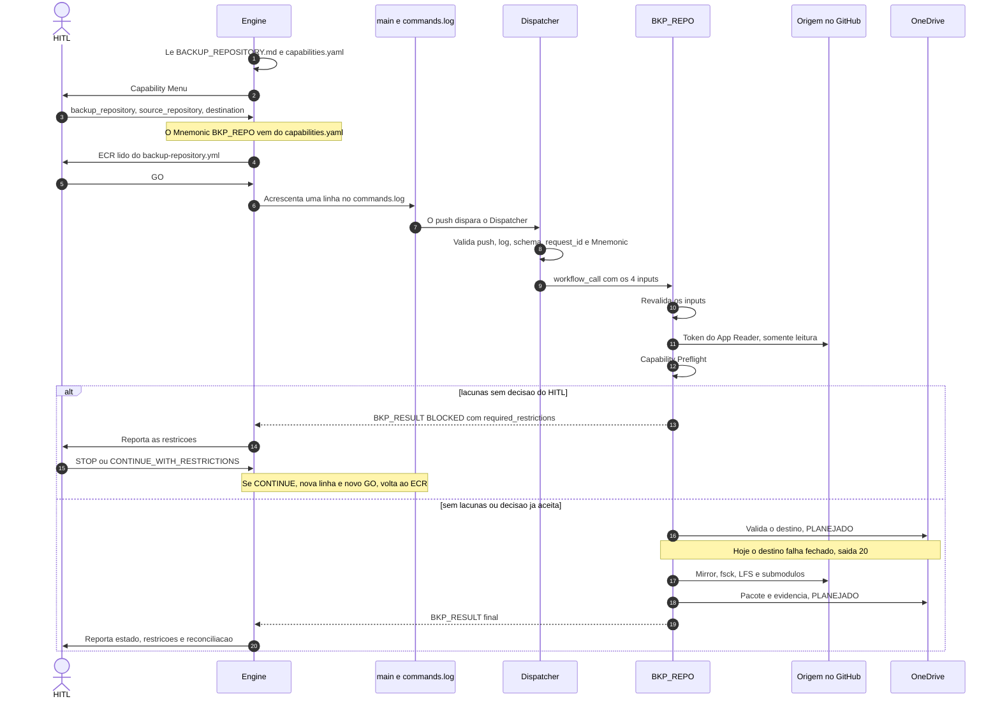

# Backup Repository — Portable Execution Protocol

## Purpose
Authoritative portable entry point for the Full Repository Preservation Process. An AI engine MUST be able to start without prior conversation memory.

## Mandatory execution sequence

```text
Capability
    ↓
Parameters
    ↓
Exact Command Request
    ↓
HITL GO
    ↓
Capability Preflight
    ↓
Assess effective execution capability for everything that may affect preservation
    ↓
        MATERIAL GAP?
       /             \
     NO              YES
      |                |
      |          disclose exactly:
      |          - what cannot be read/discovered
      |          - gap classification
      |          - required capability
      |          - routes assessed
      |          - cause
      |          - preservation impact
      |          - resulting restriction
      |                ↓
      |              HITL
      |          /             \
      |        STOP   CONTINUE_WITH_RESTRICTIONS
      |          |              |
      |          |      record accepted restrictions
      |          |              |
      |          └──────┬───────┘
      |                 |
      └─────────────────┘
                        ↓
                 Source Inventory
```

This sequence MUST NOT be shortened, reordered, or silently bypassed for `backup_repository`.

## Non-negotiable rules
1. Never infer authorization.
2. Never mutate `SOURCE_REPOSITORY`.
3. Never inherit execution-specific parameters from a prior run.
4. Never treat missing evidence as success.
5. Never expose secret plaintext in chat, logs, plaintext evidence, or ordinary preservation artifacts.
6. HITL applies only to the exact Command Request presented.
7. Authorization is non-transitive and non-reusable.
8. Backup never authorizes cleanup, deletion, rename, archive, or source modification.
9. Inability to read or discover an object MUST NOT be interpreted as evidence that the object is absent.
10. Any restriction accepted by HITL MUST remain traceable through Source Inventory, evidence, reconciliation, manifest, and final reporting.
11. A current engine or connector limitation MUST NOT by itself reopen an architectural gap for which an approved route already exists.
12. `FACTUAL_INVENTORY_PENDING` is not a Capability Preflight gap.
13. No preservation capability depends for its architectural existence on a single engine, connector, workflow, or deterministic executor.
14. Source Inventory MUST NOT begin before the Capability Preflight gate is resolved.

## Start procedure
1. Read this document and `backup/capabilities.yaml`.
2. Present the Capability Menu.
3. Wait for the human to select a capability.
4. Collect or explicitly confirm every required execution parameter.
5. Construct the Exact Command Request using `backup/schemas/command-request.schema.yaml`.
6. Present that Exact Command Request to HITL when required.
7. Execute only after `GO`.
8. Reject on `NO-GO`, missing parameters, scope mismatch, or missing authorization.
9. For `backup_repository`, execute the mandatory Capability Preflight after `GO` and before Source Inventory.
10. Assess the effective execution capability for every applicable object class.
11. If no material gap exists, proceed to Source Inventory.
12. If a material gap exists, disclose it and request `STOP` or `CONTINUE_WITH_RESTRICTIONS`.
13. On `STOP`, do not start Source Inventory.
14. On `CONTINUE_WITH_RESTRICTIONS`, record each accepted restriction with a stable `restriction_id` and proceed only under those restrictions.
15. Preserve accepted restrictions through evidence, reconciliation, manifest, and final reporting.
16. Collect and validate evidence.
17. Report preservation state, limitations, accepted restrictions, reconciliation result, and next applicable HITL.

## Governed command flow (engine → commands.log → dispatcher → workflow)
1. The engine reads this document and presents the Capability Menu; HITL selects one capability.
2. `backup/capabilities.yaml` maps the capability to its Mnemonic (`backup_repository` → `BKP_REPO`) and required parameters; HITL supplies the values.
3. The workflow bound to the Mnemonic (`command_workflow.path`) fully defines the Exact Command Request: the `on: workflow_call` inputs plus the constraints stated in their descriptions. The engine reads the workflow and presents the ECR exactly as defined.
4. Only after `GO`, the engine appends one JSON line to `commands.log` on `main` (`backup/schemas/commands-log-line.schema.yaml`): `request_id`, `mnemonic`, `ts`, `authorization` and the authorized `params`. The set of `params` varies per Mnemonic schema. `commands.log` is append-only, and it is the only file written directly on `main`.
5. `dispatcher.yml` runs on every push to `main` (so the direct-write control also sees pushes that do not touch `commands.log`), dispatches only when `commands.log` changed, reads only the new lines, validates them (schema, unique `request_id`, no edits to existing lines, and no direct push of files other than `commands.log` unless the commit belongs to a merged pull request; any violation fails the whole push and dispatches nothing) and calls the Mnemonic's workflow through a fixed mapping (`workflow_call`, `secrets: inherit`).
6. The workflow revalidates its inputs, runs Capability Preflight, executes and produces schema 2.0 evidence. The engine reports the result to HITL.

The workflow reports every outcome as one `BKP_RESULT {json}` line in its job log (statuses `REJECTED`, `BLOCKED`, `PREFLIGHT_OK`, `COMPLETE`, `COMPLETE_WITH_EXCEPTIONS`, `FAILED`); the engine reads that line to report to HITL. A `BLOCKED` result for preflight gaps lists `required_restrictions`; the follow-up `commands.log` line must accept every one of them. Destination validation fails closed before Source Inventory, and evidence is built only after it passes.

Capability Preflight gaps: the workflow is unattended, so a material gap ends the run as `BLOCKED` with `GAPS_IDENTIFIED` evidence. HITL then decides `STOP` or `CONTINUE_WITH_RESTRICTIONS`; the latter requires a new `commands.log` line carrying `preflight_decision` with stable `restriction_id` values. Authorization is never reused.

The operational guide (players, files, secrets, exit codes), in Portuguese, is at the end of this document.

Boundaries: code changes only through pull request; direct writes to `main` only to `commands.log` and only after `GO`; the source is always READ-ONLY; OneDrive uses delegated OAuth (`Files.ReadWrite.AppFolder`), never OIDC.

## Capability Menu
Canonical definitions are in `backup/capabilities.yaml`.

- `backup_repository`
- `backup_projects`
- `list_capabilities`
- `show_status`
- `validate_evidence`
- `help`

The engine MUST NOT silently select a preservation capability.

Only a capability that has a Mnemonic and a bound workflow can produce a `commands.log` line. Today that is `backup_repository` (`BKP_REPO`) only. `backup_projects` has no Mnemonic and no executor (`NOT_MATERIALIZED`); the informational and validation capabilities are answered by the engine in the conversation and never produce a command line.

## HITL parameter acquisition
Execution-specific values MUST be supplied or explicitly confirmed by the human. Conversation context MAY propose a value but MUST NOT replace confirmation.

`backup_repository` requires at minimum:
- `source_repository`;
- `destination`.

`backup_projects` requires:
- `scope` — `SOURCE_REPOSITORY`, `PROJECT`, or `OWNER_PROJECT_SET`;
- the corresponding `scope_identifiers`;
- `destination`.

Changing any execution parameter after authorization requires a new Exact Command Request and new HITL authorization.

## Capability Preflight

### Purpose
Capability Preflight answers one question before Source Inventory:

> Does the authorized execution process have effective READ/discovery capability for everything that may materially affect the requested preservation scope?

It does not ask only what the current AI engine or current connector can do.

### Effective execution capability
Effective execution capability is evaluated from the authorized combination of routes available to the execution, including, when applicable:

- engine-native capability;
- connectors;
- Git;
- REST APIs;
- GraphQL APIs;
- authorized API/identity routes;
- specialized capabilities;
- deterministic executors.

Each route MUST be assessed separately. The aggregate assessment determines whether the required READ/discovery capability is available.

A deterministic executor MAY implement a route but is not the definition of the capability itself.

References to deterministic executors are registered in `backup/capabilities.yaml`. `github_actions:backup-repository.yml` is `MATERIALIZED` (workflow `.github/workflows/backup-repository.yml`, executor of the `BKP_REPO` Mnemonic). `github_actions:backup-projects.yml` is `NOT_MATERIALIZED` and its historical existence is `NOT_DETERMINED`. The absence of an executor MUST NOT be treated by itself as proof that an architectural capability is absent.

### Routing terminology
Routing outcomes are:

- `DIRECT`
- `ROUTED`
- `PARTIAL`
- `LIMITATION`

`WORKFLOW` is preserved as a historical/specialized route mechanism. It is not a synonym for the generalized `ROUTED` outcome.

### Classification
Capability Preflight distinguishes:

- `ARCHITECTURAL_GAP` — no sufficient preservation/read architecture has been defined for a material requirement;
- `EXECUTION_CAPABILITY_GAP` — architecture exists, but the currently authorized execution has no sufficient operational route;
- `ACCESS_PERMISSION_GAP` — an otherwise applicable route is blocked by access, authorization, identity, or permission;
- `FACTUAL_INVENTORY_PENDING` — the architecture/route exists, but a source-instance fact can only be established during Source Inventory.

Only the first three are material Capability Preflight gaps.

`FACTUAL_INVENTORY_PENDING` MUST be recorded separately. It MUST NOT be placed in `gaps[]`, MUST NOT change `PASS` to `GAPS_IDENTIFIED`, and MUST NOT trigger the second HITL by itself.

### Material-gap HITL
For every material gap, disclose:

- object class;
- what cannot be read or discovered;
- gap classification;
- required capability;
- routes assessed;
- cause;
- preservation impact;
- resulting restriction.

HITL MUST explicitly decide:

- `STOP`; or
- `CONTINUE_WITH_RESTRICTIONS`.

`STOP` prevents Source Inventory from starting.

`CONTINUE_WITH_RESTRICTIONS` authorizes Source Inventory only under the restrictions explicitly accepted by HITL. Each accepted restriction MUST receive a stable `restriction_id`.

A limitation MUST NEVER be converted into evidence that an object is absent, not applicable, preserved, or successfully verified.

## Capability Registry and routing requirements
`backup/capabilities.yaml` is the primary machine-readable policy/control registry for:

- applicable object classes;
- required READ/discovery capabilities;
- approved route types;
- temporal preservation controls;
- Protected Information controls;
- alert semantics;
- Projects preservation;
- Codespaces repository-state delta;
- O-24/Open-Set Discovery Control.

Architecturally defined routes remain defined even when a particular execution cannot currently use them. Operational availability is established by Capability Preflight.


## Capability ↔ Implementation Artifact Traceability
`backup/capabilities.yaml` is the single canonical registry for capability-to-artifact traceability. A separate artifact registry MUST NOT be required.

Every declarative or executable implementation artifact that implements, validates, schematizes, configures, or supports the capability system MUST have a stable logical `artifact_id` and explicit relationship(s) to one or more registered `capability_id` values.

The canonical relationship types are:

- `EXECUTES`
- `VALIDATES`
- `SCHEMATIZES`
- `CONFIGURES`
- `SUPPORTS`

The relationship model is N:M. A capability MAY relate to multiple artifacts and an artifact MAY relate to multiple capabilities. The authoritative relationship is stored once in the implementation-artifact registry; reverse Artifact → Capability lookup MUST be derived from those relationships rather than maintained as a second source of truth.

Each registered implementation artifact records, at minimum:

- stable `artifact_id`;
- artifact type;
- repository and path;
- purpose;
- materialization status;
- integrity/version tracking mechanism;
- validation state;
- capability relationships.

### Materialization and integrity
`MATERIALIZED` and `NOT_MATERIALIZED` describe whether the registered implementation artifact currently exists. They are distinct from validation and integrity state.

For Git-versioned materialized artifacts, the current Git blob SHA is the canonical content-integrity/version identifier and the Git commit SHA is change provenance. The current blob SHA MUST be resolved and compared during traceability validation; an artifact MUST NOT be required to embed its own blob SHA.

A `NOT_MATERIALIZED` executor or workflow MAY remain registered as an architectural implementation reference. Its absence does not by itself remove the capability definition.

### Referential Integrity and Broken Reference Detection
For every registered `MATERIALIZED` artifact, the registered repository/path MUST resolve to an existing object. Failure produces `BROKEN_REFERENCE` and MUST NOT be interpreted as successful validation.

A registered `NOT_MATERIALIZED` artifact is permitted to have no object at its future path.

### Orphan Artifact Detection
Implementation-artifact locations MUST be checked for capability-system artifacts that exist without a registered `artifact_id`. Such an object is an `ORPHAN_ARTIFACT`.

Orphan detection applies to implementation artifacts within managed locations and MUST NOT classify every unrelated repository file as an implementation artifact merely because it exists.

### Impact Analysis and Revalidation
Whenever a materialized implementation artifact changes:

1. identify its stable `artifact_id`;
2. derive every affected capability from the canonical relationships;
3. mark the affected capability/artifact relationship for revalidation;
4. perform the applicable validation before treating the changed implementation as validated.

A changed Git blob SHA therefore triggers impact analysis; it does not change the logical `artifact_id`.

These traceability rules are generic and apply equally to current and future capabilities. No capability receives a private or weaker traceability model.

## Git preservation
The Git object class includes the requirements to:

- preserve the full Git object graph using full mirror semantics;
- preserve all material refs, including pull-request refs when present;
- detect Git LFS and preserve/verify LFS objects when used;
- detect submodules and record explicit disposition;
- preserve a navigable repository tree separately from the Git mirror;
- reconcile source and preserved refs and target SHAs;
- perform Git object-integrity verification.

These are preservation requirements, not permission to mutate the source.

## Temporal preservation, MRBI and CRR
Temporal/volatile classes MUST be prioritized before stable objects once backup execution is authorized.

`MRBI` — Maximum Recommended Backup Interval — is governed by the shortest applicable deterministic retention window among discovered temporal preservation classes.

A non-time-bound eviction risk MUST NOT be converted into a numeric MRBI. It produces `VOLATILITY_ALERT`.

`CRR` — Current Repository Retention — is the effective applicable retention observed for the source. It MUST be read/preserved as evidence when applicable and MUST NOT be inferred from a product default.

Canonical alerts are:

- `RETENTION_ALERT`
- `VOLATILITY_ALERT`
- `ACCESSIBILITY_ALERT`

Temporal unavailability MUST be evidenced rather than silently treated as source absence.

## Protected Information
Protected Information handling is metadata-first and recoverability-aware.

Secret plaintext is not required to claim architectural completeness when the source platform does not expose it. Preserve permitted metadata, scope, provenance, relationships, authoritative-source references, recoverability, value-preservation status, and reconstruction/reissuance treatment.

Any attempt to recover plaintext from an external authoritative source when not already covered by the Exact Command Request requires operation-specific HITL authorization.

## Webhooks and deliveries
Preserve readable webhook configuration and readable delivery evidence.

Webhook deliveries are temporal evidence and are subject to temporal-preservation controls.

Webhook secret plaintext is not required when the platform does not expose it; preserve presence/metadata and reissuance treatment when observable.

External systems reached by webhooks remain reference-only unless separately and explicitly scoped. Webhook preservation MUST NOT silently expand authorization into external systems.

## Backup Projects
`backup_projects` is independently callable and is also included by `backup_repository` when related Projects exist.

Approved scopes:

- `SOURCE_REPOSITORY`
- `PROJECT`
- `OWNER_PROJECT_SET`

Projects preservation may require combined authorized REST and GraphQL READ surfaces. No single surface is assumed complete.

Preserve, when exposed and applicable:

- identity and metadata;
- repository relationships;
- fields/options/configuration;
- items;
- draft issues;
- issue and pull-request references;
- field values;
- archived item state;
- views/configuration;
- workflows/automations;
- status updates;
- other discovered Project state.

The preserved representation MUST be machine-readable, schema-controlled, reconstructible as an equivalent representation, provenance-aware, and reusable downstream.

A missing Project Graph surface in the current engine/connector is an execution-surface fact, not automatically an architectural gap.

## Codespaces repository-state delta
The authoritative preservation scope for Codespaces is repository-state delta only:

- unpushed commits;
- modified tracked files;
- untracked repository content.

The required order is:

`discover → assess accessibility → verify repository-state delta → record evidence/state → evaluate retention`.

VM/environment state outside repository-state delta is excluded unless separately scoped.

An official export by itself MUST NOT be treated as proof that repository-state delta preservation is complete.

Accessibility risk and retention risk are independent. Use `ACCESSIBILITY_ALERT` and temporal alerts as applicable.

## O-24 — Open-Set Discovery Control
`other_discovered_state` is not an unresolved architectural gap. It is the O-24 open-set discovery control.

Any newly discovered material source/platform state MUST be:

1. classified;
2. assigned an applicable preservation route or explicit disposition;
3. evidenced;
4. reconciled.

It MUST NOT be silently omitted.

## Execution boundary
`Moriblo/repo_backup` is the execution/control repository.

Authorized execution routes may READ the authorized source and WRITE only to the authorized preservation destination. They MUST NOT write to `SOURCE_REPOSITORY`.

No particular GitHub Actions workflow is required for the architectural existence of a capability.

## Preservation states
Every discovered material source object ultimately receives one of:

- `PRESERVED`
- `PRESERVED-AS-EQUIVALENT-REPRESENTATION`
- `PARTIALLY-PRESERVED`
- `NON-EXPORTABLE`
- `FAILED`
- `NOT-VERIFIED`

No material state may be silently omitted.

## Evidence, restrictions, manifest and final reporting
`backup/schemas/evidence.schema.yaml` records preservation evidence and carries Capability Preflight restrictions through stable `restriction_id` references.

`backup/schemas/backup-manifest.schema.yaml` is the authoritative machine-readable reconciliation of preserved artifacts, accepted restrictions, limitations, and reconciliation counts.

Until a dedicated final-report schema exists, the validated Manifest is the authoritative input for accepted restrictions and limitations in Final Reporting. Final Reporting MUST NOT remove, weaken, or silently resolve restrictions present in the Manifest.

A clean `COMPLETE` result is permitted only when there are:

- no accepted restrictions;
- no limitations;
- no partial objects;
- no non-exportable objects;
- no failed objects;
- no not-verified objects;
- no unreconciled object classes;
- and restrictions are reconciled.

Otherwise a completed preservation with explicitly accepted exceptions MUST use `COMPLETE_WITH_EXCEPTIONS`, subject to schema validation.

Workflow, route, or tool completion alone is never proof of preservation completion.

## Fail-closed behavior
Stop rather than infer when:

- parameters are absent;
- HITL is ambiguous;
- authorization differs from the Exact Command Request;
- scope exceeds authorization;
- source READ-only cannot be guaranteed;
- destination cannot be validated;
- evidence is insufficient;
- a material Capability Preflight gap has not received its required HITL decision.

A material Capability Preflight gap is not automatically fatal. It is disclosed to HITL. If HITL chooses `CONTINUE_WITH_RESTRICTIONS`, the accepted restrictions remain material limitations throughout Source Inventory, evidence, reconciliation, Manifest, and Final Reporting.

## Portability
No engine may rely on hidden conversation state, prior runs, remembered repository identifiers, or a prior HITL as authorization.

Execution context is established by the current Exact Command Request and its HITL authorization.

The protocol is engine-agnostic: capability is the effective authorized execution capability, not the native capability set of whichever engine happens to be interacting with the human.


---

# Guia operacional (pt-BR)

> **O que é esta parte.** Guia para quem opera e mantém o sistema (o HITL e futuros mantenedores). O protocolo acima, em inglês, é o texto **normativo**; este guia explica **quem faz o quê, com quais arquivos e segredos**, e como ler os resultados. Se houver conflito, vale o protocolo.
>
> **Estado descrito:** `main` em 29/09/2026. Itens ainda inexistentes estão marcados como **PLANEJADO** e serão atualizados quando o PR do OneDrive (SA-08 da issue #7) for mergeado.

## 1. Players

| Player | Papel |
|---|---|
| **HITL** (humano) | Escolhe a capability, informa os parâmetros, dá GO/NO-GO, decide `STOP` ou `CONTINUE_WITH_RESTRICTIONS` no preflight e faz o merge dos PRs. |
| **Engine** (hoje, a sessão do Claude Code; outros no futuro, ver issue #5) | Lê este protocolo, apresenta o menu e o ECR, grava a linha no `commands.log` após o GO e reporta o resultado ao HITL. Nunca infere autorização. |
| **Repositório `repo_backup`** (`main`) | Guarda o código, o `commands.log`, os segredos e as variáveis. Código só entra por pull request. |
| **GitHub Actions** | Executa o Dispatcher e o workflow do `BKP_REPO` (e, temporariamente, o diagnóstico). |
| **GitHub App "Repository Preservation Reader"** | Emite, a cada execução, um token de curta duração só de leitura (`contents: read`, `metadata: read`) para a origem. |
| **GitHub App Writer** (**PLANEJADO**) | Grava o novo refresh token do OneDrive no secret. Só *Secrets: Read and write*, instalado só neste repositório. |
| **Repositório de origem** | É lido e **nunca alterado** (READ-ONLY). |
| **Microsoft Entra (app público)** (**PLANEJADO**) | Emite os tokens do OneDrive pela autoridade `consumers` (conta pessoal). |
| **Microsoft Graph / OneDrive** (**PLANEJADO**) | Recebe o pacote e a evidência em `Apps/<nome do registro>/…`. |

## 2. Fluxo operacional

### 2.1 Preparação, uma única vez (**PLANEJADO**, ver SA-08)
0a. O HITL configura o registro no Entra: aceitar contas pessoais, permitir fluxos de cliente público, permissões **delegadas** `Files.ReadWrite.AppFolder` e `offline_access`.
0b. O HITL cria o GitHub App Writer.
0c. O HITL roda `onedrive_authorize.py` no computador dele, faz o login, e o script imprime o refresh token só no terminal.
0d. O HITL grava os segredos e as variáveis (seção 4).

### 2.2 A cada execução (resumo)

Esta tabela é o resumo. O detalhe de cada passo, o diagrama e o caminho do Mnemonic estão nas seções 2.3 a 2.7.

| # | Quem | O que acontece | Situação hoje |
|---|---|---|---|
| 1 | Engine | Lê este protocolo e o `capabilities.yaml` e apresenta o **Capability Menu**. | Existe |
| 2 | HITL | Escolhe `backup_repository` e informa `source_repository` e `destination` (caminho **relativo ao AppFolder**). | Existe |
| 3 | Engine | Lê o `backup-repository.yml` e apresenta o **ECR** exatamente como o workflow define. | Existe |
| 4 | HITL | Dá **GO** ou NO-GO. A autorização vale só para esse ECR exato. | Existe |
| 5 | Engine | Acrescenta **uma linha** no `commands.log` do `main`, com o **Mnemonic copiado do registro**. É a única escrita direta permitida no `main`. | Existe |
| 6 | Actions | O push dispara o **Dispatcher**: valida intervalo do push, controle de escrita direta, append-only, schema, `request_id` único e Mnemonic (conhecido e coerente com o registro). | Existe |
| 7 | Actions | O Dispatcher **traduz o Mnemonic em workflow** (mapeamento fixo) e chama o `BKP_REPO` (`workflow_call`, `secrets: inherit`). | Existe |
| 8 | Actions | O `BKP_REPO` revalida os inputs e emite o token do App Reader. | Existe |
| 9 | Actions | **Capability Preflight.** Com lacunas materiais e sem decisão do HITL, termina `BLOCKED`. | Existe |
| 10 | Engine → HITL | O engine lê a linha `BKP_RESULT` no log do job e reporta. O HITL decide `STOP` ou `CONTINUE_WITH_RESTRICTIONS`. Se continuar, volta ao passo 3 com **nova linha** (`preflight_decision` e novo `request_id`). | Existe |
| 11 | Actions | **Valida o destino.** Hoje sempre falha fechado (saída 20). Depois do SA-08: renova o access token, grava o novo refresh token no secret e faz escrita e leitura de teste no AppFolder. | Falha fechado; validação real **PLANEJADA** |
| 12 | Actions | **Lê a origem:** mirror, fsck, LFS e submódulos. A comparação das refs da origem com as do mirror é **PLANEJADA**. | Parcial |
| 13 | Actions | Gera o pacote (`git bundle`) e envia ao OneDrive em blocos, conferindo o SHA-256. | **PLANEJADO** |
| 14 | Actions | Gera `evidence.json` e `manifest.json` (schemas 2.0), valida e publica o artefato. O envio da evidência ao OneDrive é **PLANEJADO**. | Parcial |
| 15 | Engine → HITL | Lê o resultado e reporta estado, restrições aceitas e reconciliação. | Existe |

**Observações**
- Com as 17 restrições atuais (todas as classes, menos o Git), toda execução exige **duas linhas** no `commands.log`: a primeira termina `BLOCKED`; a segunda carrega a decisão do HITL.
- O `request_id` de uma linha rejeitada ou bloqueada fica **queimado**: o log é append-only e a autorização não é reutilizável.
- Enquanto o passo 11 falhar fechado, nada é copiado e nenhuma evidência é gerada.

### 2.3 Fluxo detalhado, passo a passo

Cada passo abaixo diz **quem** age, **o que entra**, **o que acontece** (com os arquivos envolvidos), **o que pode falhar** e **o que sai**. A tabela da seção 2.2 é o resumo; esta seção é o detalhe. As marcas **(PLANEJADO)** indicam o que só passa a existir com o PR do OneDrive (SA-08).

#### Passo 1: o engine apresenta o Capability Menu
- **Quem:** Engine.
- **Entra:** o pedido do HITL para iniciar um backup.
- **O que acontece:** o engine lê este `BACKUP_REPOSITORY.md` e o `backup/capabilities.yaml` (lista `capabilities`) e apresenta as seis capabilities. Ele **não escolhe** por conta própria.
- **Lê / escreve:** lê os dois arquivos; não escreve nada.
- **Se falhar:** se não conseguir ler o registro, o engine para e avisa (fail-closed). Nada é inferido de conversas anteriores.
- **Sai:** o menu na tela do HITL.

#### Passo 2: o HITL escolhe a capability e informa os parâmetros
- **Quem:** HITL (o engine consulta o registro).
- **Entra:** o menu.
- **O que acontece:**
  1. O HITL escolhe `backup_repository`.
  2. O engine consulta o registro e descobre dois fatos: o **Mnemonic** da capability (`mnemonic: BKP_REPO`, no `capabilities.yaml`) e os **parâmetros requeridos** (`parameters`: `source_repository` e `destination`).
  3. O HITL informa ou confirma cada valor. O engine pode **propor**, mas nunca substitui a confirmação, e nada é herdado de execuções anteriores.
- **Se falhar:** valor fora do formato é recusado. Exemplo real: o `destination` informado como URL do OneDrive foi recusado, porque o destino precisa ser um caminho **relativo ao AppFolder** (sem `/` inicial e sem `..`).
- **Sai:** capability, Mnemonic e valores.

#### Passo 3: o engine apresenta o ECR (Exact Command Request)
- **Quem:** Engine.
- **Entra:** capability, Mnemonic e valores.
- **O que acontece:** o engine lê os `inputs` do `on: workflow_call` do workflow do Mnemonic (`.github/workflows/backup-repository.yml`) e apresenta cada campo **exatamente como o workflow o define**, com a sua restrição e o valor proposto. Antes de apresentar, confere os valores contra o schema da linha (`commands-log-line.schema.yaml`).
- **Lê / escreve:** lê o workflow e o schema; não escreve nada.
- **Sai:** o ECR completo para o GO.

#### Passo 4: o HITL dá GO ou NO-GO
- **Quem:** HITL.
- **O que acontece:** o GO vale **somente para este ECR exato**. Mudou qualquer valor, é um novo ECR e um novo GO.
- **Se falhar:** NO-GO, resposta ambígua ou ausente: nada é gravado. Nenhuma autorização é presumida.
- **Sai:** a autorização.

#### Passo 5: o engine grava a linha no `commands.log`
- **Quem:** Engine, com uma identidade autorizada a gravar no `main` (hoje, o actor `Moriblo`; ver a issue #5).
- **Entra:** o ECR autorizado.
- **O que acontece:**
  1. O engine monta **uma linha JSON**: `request_id`, `mnemonic` (copiado do registro, sem alteração), `ts` (hora atual, UTC), `authorization` e `params` (ver a seção 2.5).
  2. Como boa prática adotada nas execuções reais, ele roda o mesmo verificador do dispatcher **localmente**, antes do push.
  3. Faz um commit **só com o `commands.log`** e o envia direto ao `main`. É a **única escrita direta** permitida no `main`.
- **Lê / escreve:** escreve o `commands.log` (só acrescenta ao fim).
- **Se falhar:** push recusado: nada dispara, nada é gravado.
- **Sai:** um push no `main`, que dispara o Dispatcher.

#### Passo 6: o Dispatcher valida o push e as linhas novas
- **Quem:** GitHub Actions, workflow `dispatcher.yml`, job **"Validate push and new command lines"**, executando `backup/scripts/dispatch_check.py`.
- **Entra:** o intervalo do push (commit anterior e commit novo).
- **O que acontece:** as verificações rodam nesta ordem, e **a primeira que falhar recusa o push inteiro**:
  1. **Intervalo:** existe commit anterior e ele é ancestral do novo (recusa criação de branch e reescrita de histórico).
  2. **Escrita direta:** cada commit da linha principal que toca arquivos além do `commands.log` precisa vir de um pull request mergeado (consulta à API). Commit que mistura `commands.log` com outros arquivos é recusado.
  3. **O log mudou?** Se não mudou (ex.: merge de PR), o push é aceito e não há nada a despachar. É o que se vê nos runs verdes a cada merge.
  4. **Append-only:** o conteúdo antigo é prefixo exato do novo; a última linha termina em quebra de linha; não há linha em branco.
  5. **Cada linha nova:** é JSON válido e cumpre o `commands-log-line.schema.yaml`.
  6. **`request_id` único:** não repete nenhum id já presente no log nem outro do mesmo push.
  7. **Mnemonic:** consta no mapeamento fixo do dispatcher **e** o registro (`capabilities.yaml`) concorda com o workflow mapeado.
- **Se falhar:** saída **30**, o job fica vermelho e **nada é despachado**. A mensagem diz qual regra falhou, sem repetir o conteúdo da linha.
- **Sai:** a linha `DISPATCH_ACCEPTED {json}` com os `request_id` aceitos e a matriz de despacho.

#### Passo 7: o Dispatcher chama o workflow do Mnemonic
- **Quem:** GitHub Actions, job **`run-bkp-repo`** (nome "BKP_REPO `<request_id>`").
- **Entra:** a matriz com uma entrada por linha aceita.
- **O que acontece:** o dispatcher **traduz o Mnemonic em workflow** pelo mapeamento fixo (`BKP_REPO` → `.github/workflows/backup-repository.yml`) e o chama por `workflow_call`, com `secrets: inherit`, passando os quatro inputs do ECR: `request_id`, `source_repository`, `destination` e `preflight_decision`. Há um grupo de concorrência por `request_id`.
- **Se falhar:** sem linhas novas, o job é **pulado** (aparece como cinza no run); não é erro.
- **Sai:** uma execução do `BKP_REPO` por linha aceita.

#### Passo 8: o `BKP_REPO` começa
- **Quem:** GitHub Actions, `backup-repository.yml`.
- **O que acontece:**
  1. Baixa este repositório (scripts e schemas) e instala as bibliotecas do validador.
  2. **`validate-inputs`:** revalida os inputs contra o mesmo schema da linha (segunda barreira). Também recusa `preflight_decision` ilegível e recusa reutilização de autorização (`previous_request_id` igual ao `request_id`).
  3. **Token do App Reader:** emite um token de curta duração, só de leitura (`contents: read`, `metadata: read`), válido só para o repositório de origem.
- **Se falhar:** entrada inválida termina com saída **2** e `BKP_RESULT` **`REJECTED`**. A falha do **token não derruba** o workflow: ela vira uma lacuna no preflight.
- **Sai:** inputs válidos e, se possível, um token de leitura.

#### Passo 9: Capability Preflight
- **Quem:** GitHub Actions, `bkp_repo.py preflight`.
- **O que acontece:** avalia as **18 classes** do `backup_repository` (`includes` do registro). Cada rota é avaliada separadamente. Hoje só a classe **`git`** tem rota implementada; as outras **17** viram lacuna `EXECUTION_CAPABILITY_GAP`. Se o token não foi emitido, o `git` também vira lacuna (`ACCESS_PERMISSION_GAP`), e são **18**. O resultado é validado contra o schema do command-request e gravado em `evidence/preflight.json`.
- **Decisão:** a execução só segue se **todas** as restrições exigidas estiverem em `preflight_decision.accepted_restrictions`. Aceitar menos mantém o bloqueio.
- **Sai:**
  - Saída **10**: `BKP_RESULT` **`BLOCKED`** (`CAPABILITY_PREFLIGHT_GAPS`), com a lista `required_restrictions`. Os passos seguintes são pulados.
  - Saída **0**: `BKP_RESULT` **`PREFLIGHT_OK`**.
- **Sempre:** o artefato `bkp-repo-<request_id>` é publicado, mesmo com `BLOCKED`.

#### Passo 10: o engine reporta e o HITL decide
- **Quem:** Engine e HITL.
- **O que acontece:** o engine lê a linha `BKP_RESULT` no log do passo "Capability Preflight" (Actions, run do Dispatcher, job "BKP_REPO `<request_id>`") e apresenta ao HITL as restrições exigidas. O HITL escolhe:
  - **`STOP`:** encerra. Nenhuma linha é gravada. O `request_id` usado continua queimado.
  - **`CONTINUE_WITH_RESTRICTIONS`:** o engine monta uma **nova linha**, com **novo `request_id`**, os **mesmos** `source_repository` e `destination`, e o bloco `preflight_decision` (`previous_request_id` = a requisição bloqueada; `hitl_decision`; `accepted_restrictions` = os itens de `required_restrictions`). O fluxo **volta ao passo 3**: é um novo ECR, com novo GO.
- **Sai:** o encerramento, ou uma nova rodada a partir do passo 3.

#### Passo 11: validação do destino
- **Quem:** GitHub Actions, `bkp_repo.py validate-destination`.
- **Hoje:** **sempre falha fechado**: saída **20**, `BKP_RESULT` **`BLOCKED`** (`DESTINATION_NOT_VALIDATED`). Nada é copiado. É o comportamento correto até o OneDrive existir.
- **(PLANEJADO)** Com o SA-08: renova o access token, grava o novo refresh token no secret pelo App Writer e faz uma escrita e uma leitura de teste no AppFolder.

#### Passo 12: leitura da origem
- **Quem:** GitHub Actions, passos bash do `backup-repository.yml`.
- **O que acontece (só chega aqui com o destino validado):**
  1. Confere `git` e `git-lfs` no runner.
  2. Clona a origem com `git clone --mirror`. O token vai por cabeçalho HTTP, só nesse processo: não aparece na URL, no log nem na configuração do mirror.
  3. Grava `refs.tsv`, `git-fsck.txt` (`fsck --full --strict`) e `git-count-objects.txt`.
  4. Enumera Git LFS em todas as refs; havendo objetos, baixa todos e confere o SHA-256 de cada um. Falhas: saída **3** (não listou), **4** (OID inválido), **5** (objeto ausente), **6** (hash divergente).
  5. Varre o histórico inteiro atrás de submódulos (`gitmodules-history.tsv`, `gitlinks-history.tsv`).
- **(PLANEJADO)** Comparação das refs da **origem** com as do mirror (`git ls-remote` contra `refs.tsv`).
- **Se falhar:** o job fica vermelho no passo que falhou.

#### Passo 13: pacote e envio ao OneDrive **(PLANEJADO)**
- Gera o pacote (`git bundle`) do mirror e o envia em blocos ao OneDrive, conferindo o SHA-256 depois do envio.

#### Passo 14: evidência e manifest
- **Quem:** GitHub Actions, `bkp_repo.py build-evidence`.
- **O que acontece:** recusa-se a rodar sem destino validado (saída **21**). Monta o `evidence.json` (a classe `git` como `PRESERVED`, ou `PARTIALLY-PRESERVED` se houver submódulos, ou `FAILED` se nenhuma ref foi lida; as demais classes como `NOT-VERIFIED`, ligadas às restrições aceitas) e o `manifest.json`, e **valida ambos contra os schemas 2.0 antes de gravar**. O status final é `COMPLETE`, `COMPLETE_WITH_EXCEPTIONS` ou `FAILED` (saída **1**).
- **Sai:** a linha final `BKP_RESULT` com `evidence_sha256`, `manifest_sha256` e a reconciliação; o artefato com os arquivos. **(PLANEJADO)** O envio da evidência ao OneDrive.

#### Passo 15: o engine reporta o resultado
- **Quem:** Engine.
- **O que acontece:** lê o `BKP_RESULT` final e reporta ao HITL o estado, as restrições aceitas, a reconciliação e os hashes. **Sucesso do workflow não prova preservação**: vale o manifest validado.

### 2.4 Diagrama do fluxo



### 2.5 Anatomia da linha do `commands.log`

Uma linha JSON por comando, sem quebras internas. Esquema em `backup/schemas/commands-log-line.schema.yaml`.

| Campo | O que é | Regra |
|---|---|---|
| `request_id` | Identificador único da requisição | 8 a 64 caracteres `[A-Za-z0-9._-]`. Não pode repetir nenhum id já usado no log. Convenção adotada: `req-AAAAMMDD-NNN`. |
| `mnemonic` | Comando a executar | Vem do registro. Valores aceitos hoje: `BKP_REPO`. |
| `ts` | Hora da gravação | UTC, ISO 8601. |
| `authorization` | O GO do HITL | `decision: GO`, `authorized_scope: EXACT_COMMAND_REQUEST`, `reusable: false`. |
| `params.source_repository` | Origem do backup | Formato `dono/nome`. Somente leitura. |
| `params.destination` | Pasta no OneDrive | Relativo ao AppFolder; sem `/` inicial e sem `..`. |
| `params.preflight_decision` | Só na linha de continuação | `previous_request_id`, `hitl_decision: CONTINUE_WITH_RESTRICTIONS`, `accepted_restrictions` (lista). |

Exemplo de uma 1ª linha (numa única linha no arquivo real):

```json
{"request_id":"req-20260929-001","mnemonic":"BKP_REPO","ts":"2026-09-29T04:35:22Z","authorization":{"decision":"GO","authorized_scope":"EXACT_COMMAND_REQUEST","reusable":false},"params":{"source_repository":"Moriblo/Minha_Caixinha_de_Saude","destination":"Minha_Caixinha_de_Saude"}}
```

A linha de continuação é igual, com outro `request_id` e, em `params`, o bloco `preflight_decision` (abreviado aqui):

```json
"preflight_decision":{"previous_request_id":"req-20260929-001","hitl_decision":"CONTINUE_WITH_RESTRICTIONS","accepted_restrictions":[{"restriction_id":"RST-issues-EXECUTION_CAPABILITY_GAP","object_class":"issues","restriction":"...","source_gap_classification":"EXECUTION_CAPABILITY_GAP"}]}
```

O log é **append-only**: uma linha nunca é editada nem apagada. Uma linha recusada continua no arquivo, e o `request_id` dela fica **queimado**.

### 2.6 De onde vem o Mnemonic

| Etapa | Quem | O que faz |
|---|---|---|
| **Declaração** | Registro (`backup/capabilities.yaml`, capability `backup_repository`, campo `mnemonic: BKP_REPO`) | É a **origem**. O Mnemonic é um rótulo fixo, declarado por escrito e alterado só por pull request. |
| **Leitura** | Engine (passos 1 e 2) | Descobre o Mnemonic ao ler o registro e ao HITL escolher a capability. |
| **Transporte** | Engine (passo 5) | Copia o Mnemonic para o campo `mnemonic` da linha, depois do GO. Não o calcula. |
| **Validação** | Dispatcher (passo 6) | Confere se o schema o aceita, se o mapeamento fixo o conhece e se o registro concorda. |
| **Tradução** | Dispatcher (passo 7) | Converte o Mnemonic em workflow: `BKP_REPO` → `backup-repository.yml`. |

Ninguém, em execução, **escolhe** o Mnemonic. Um Mnemonic novo precisa ser declarado, por pull request, em quatro lugares: o registro, o `enum` do schema da linha, o mapa do `dispatch_check.py` e um job do `dispatcher.yml`. Sem isso, o dispatcher recusa a linha.

### 2.7 Situações de uma requisição e o que fazer

| Situação | Como se chega | O que fazer |
|---|---|---|
| **Proposta** | Passo 3 | O HITL revisa o ECR. |
| **Autorizada** | GO no passo 4 | O engine grava a linha. |
| **Recusada pelo Dispatcher** | Violação no passo 6 (saída 30) | Corrigir a causa. Se a linha já entrou no log, o `request_id` está queimado: a nova tentativa usa **outro** id, e a linha ruim permanece no log. |
| **`REJECTED`** | Inputs inválidos no passo 8 (saída 2) | Idem: corrigir e gravar nova linha com novo id. |
| **`BLOCKED` (preflight)** | Lacunas sem decisão (saída 10) | O HITL decide `STOP` ou `CONTINUE_WITH_RESTRICTIONS` (passo 10). |
| **`BLOCKED` (destino)** | Destino não validado (saída 20) | Resolver a causa. Hoje, isso depende do PR do OneDrive. |
| **`PREFLIGHT_OK`** | Preflight passou | A execução segue para o destino e a leitura da origem. |
| **`COMPLETE`, `COMPLETE_WITH_EXCEPTIONS`, `FAILED`** | Fim da preservação (passo 14) | O engine reporta (passo 15). Só o manifest validado prova a preservação. |

## 3. Inventário de arquivos

**Legenda de estado:** EXISTE · TEMPORÁRIO · A REMOVER · PLANEJADO.

| Arquivo | Papel | Estado |
|---|---|---|
| `BACKUP_REPOSITORY.md` | Protocolo normativo e este guia. | EXISTE |
| `README.md` | Apresentação do repositório. | EXISTE |
| `commands.log` | Fila append-only de comandos autorizados (JSON Lines). O push nele dispara o Dispatcher. | EXISTE |
| `backup/capabilities.yaml` | Registro canônico: capabilities, Mnemonics, rotas, políticas e artefatos. | EXISTE |
| `backup/schemas/commands-log-line.schema.yaml` | Formato de cada linha do `commands.log`. | EXISTE |
| `backup/schemas/command-request.schema.yaml` | Formato do Exact Command Request, incluindo o Capability Preflight. | EXISTE |
| `backup/schemas/evidence.schema.yaml` | Formato da evidência de preservação (2.0). | EXISTE |
| `backup/schemas/backup-manifest.schema.yaml` | Formato do manifest e da reconciliação (2.0). | EXISTE |
| `.github/workflows/dispatcher.yml` | Dispara no push do `main`; valida e chama o workflow do Mnemonic. | EXISTE |
| `backup/scripts/dispatch_check.py` | Verificações do Dispatcher; produz a matriz de despacho. | EXISTE |
| `.github/workflows/backup-repository.yml` | Executor do `BKP_REPO`. Seus inputs são o ECR. | EXISTE |
| `backup/scripts/bkp_repo.py` | Revalidação, preflight, gate de destino e montagem da evidência. | EXISTE |
| `.github/workflows/diagnostic-git-read.yml` | Teste manual da leitura Git. Não faz parte do fluxo e não prova preservação. | TEMPORÁRIO |
| `.github/workflows/onedrive-appfolder-oidc-read-test.yml` | Teste OIDC antigo, contrário à regra "sem OIDC". | A REMOVER (SA-08) |
| `backup/scripts/onedrive.py` | Access token, rotação do secret, destino, upload em blocos e SHA-256. | PLANEJADO (SA-08) |
| `backup/scripts/onedrive_authorize.py` | Login local único (device code) que entrega o refresh token. | PLANEJADO (SA-08) |
| Script de rastreabilidade | Confere existência, SHA e órfãos dos artefatos registrados. | PLANEJADO (SA-05) |

## 4. Segredos e variáveis

Ficam em Settings → Secrets and variables → Actions do `repo_backup`. Os valores **nunca** aparecem em chat, log, evidência ou arquivo.

| Nome | Tipo | Quem cria | Quem usa | Estado |
|---|---|---|---|---|
| `REPOSITORY_PRESERVATION_APP_ID` | variável | HITL | Emissão do token do App Reader (`backup-repository.yml`, diagnóstico) | EXISTE |
| `REPOSITORY_PRESERVATION_APP_PRIVATE_KEY` | secret | HITL | Idem | EXISTE |
| `ONEDRIVE_CLIENT_ID` | variável | HITL | `onedrive.py` | PLANEJADO |
| `ONEDRIVE_REFRESH_TOKEN` | secret | HITL (valor inicial) e App Writer (rotação) | `onedrive.py` | PLANEJADO |
| `REPOSITORY_PRESERVATION_SECRETS_APP_ID` | variável | HITL | Gravação do secret pelo App Writer | PLANEJADO |
| `REPOSITORY_PRESERVATION_SECRETS_APP_PRIVATE_KEY` | secret | HITL | Idem | PLANEJADO |

O environment `onedrive-backup` e as variáveis `AZURE_CLIENT_ID` e `AZURE_TENANT_ID` pertencem ao teste OIDC antigo e ficam obsoletos; o HITL as apaga depois do SA-08. O `secrets: inherit` repassa só secrets de repositório e de organização, **não** de environment.

## 5. Autenticação do OneDrive (**PLANEJADO**)

- O OneDrive é **pessoal**. Isso exige permissão **delegada**, ou seja, um login real com consentimento. O workflow roda sem ninguém presente e não consegue fazer esse login.
- Por isso o login é feito **uma vez**, no computador do HITL, por `onedrive_authorize.py` (device code). A Microsoft entrega um **refresh token**, e o script o imprime **só no terminal** (nunca em arquivo, repositório, log ou chat). O HITL o grava no secret `ONEDRIVE_REFRESH_TOKEN`.
- A cada backup, o workflow troca o refresh token por um access token de curta duração, com a autoridade `https://login.microsoftonline.com/consumers`, sem client secret e sem tenant ID (app público). O destino é `/me/drive/special/approot`, isto é, `Apps/<nome do registro>/`.
- **Rotação:** a Microsoft devolve um refresh token novo a cada uso. O App Writer grava o novo valor no secret **antes** de qualquer outra etapa que use o OneDrive; se a gravação falhar, o workflow para com erro claro.
- Repetir o login só se o token expirar por falta de uso (cerca de 90 dias, segundo a documentação da Microsoft; **a confirmar**).

## 6. Códigos de saída e contrato de resultado

### 6.1 Códigos de saída

| Código | Onde | Significado |
|---|---|---|
| 0 | todos | Etapa concluída. |
| 1 | `bkp_repo.py build-evidence` | Preservação com objeto `FAILED`. |
| 2 | `bkp_repo.py validate-inputs`; diagnóstico | Entrada rejeitada (schema, `preflight_decision` ilegível ou reutilização de autorização). |
| 3 | passo de LFS (bash) | Não foi possível listar os ponteiros LFS. |
| 4, 5, 6 | passo de LFS (bash) | OID inválido, objeto LFS ausente, hash LFS divergente. |
| 10 | `bkp_repo.py preflight` | `BLOCKED`: lacunas materiais sem decisão do HITL. |
| 20 | `bkp_repo.py validate-destination` | Destino não validado (falha fechado). |
| 21 | `bkp_repo.py build-evidence` | Recusa de gerar evidência sem destino validado. |
| 30 | `dispatch_check.py` | Violação no push: nada é despachado. |
| 64 | `bkp_repo.py`, `dispatch_check.py` | Uso incorreto ou variável de ambiente ausente. |

### 6.2 Linhas `BKP_RESULT` e afins
O workflow do `BKP_REPO` imprime, no log do job, **uma linha `BKP_RESULT {json}`** por desfecho (a mesma vai para o resumo do job). É ela que o engine lê.

| `status` | Quando | Campos principais |
|---|---|---|
| `REJECTED` | Entrada inválida | `reason`: `INPUT_VALIDATION` ou `AUTHORIZATION_REUSE` |
| `BLOCKED` | Preflight com lacunas sem decisão | `reason`: `CAPABILITY_PREFLIGHT_GAPS`, `hitl_decision`: `PENDING`, `required_restrictions` |
| `BLOCKED` | Destino não validado | `reason`: `DESTINATION_NOT_VALIDATED`, `detail` |
| `PREFLIGHT_OK` | Preflight passou | `preflight_status`, `hitl_decision`, `accepted_restrictions` |
| `COMPLETE`, `COMPLETE_WITH_EXCEPTIONS`, `FAILED` | Fim da preservação | `evidence_sha256`, `manifest_sha256`, `reconciliation` |

Outras linhas úteis: `DISPATCH_ACCEPTED {json}` (job `guard` do Dispatcher: lista dos `request_id` aceitos) e `DIAG_RESULT {json}` (diagnóstico da leitura Git: refs, fsck, LFS, submódulos). O log do job só fica legível depois que o job termina. A evidência bruta fica como artefato do Actions (`bkp-repo-<request_id>`, 7 dias; `diag-git-read-<run>`, 3 dias).

## 7. Ciclo de vida dos artefatos temporários e nota final

- **`diagnostic-git-read.yml`** é TEMPORÁRIO: existe só porque o gate de destino falha fechado antes do clone. Deve ser removido, junto com o registro dele no `capabilities.yaml`, quando o destino OneDrive estiver funcionando.
- **`onedrive-appfolder-oidc-read-test.yml`** será removido no SA-08.
- **`backup_projects`** aparece no menu, mas não tem Mnemonic nem executor: hoje não gera comando.
- **Como manter este guia:** ao criar, mover ou remover um arquivo, um segredo ou um código de saída, atualize as seções 3, 4 e 6 no mesmo PR. Itens *planejados* viram *existentes* no PR que os implementa.
